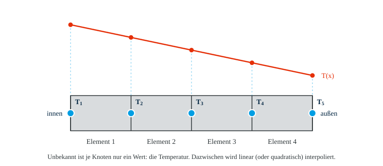
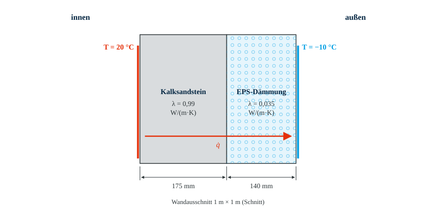
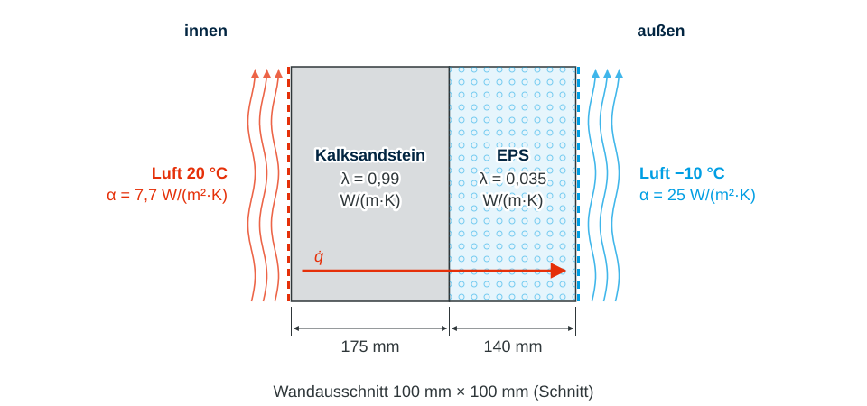
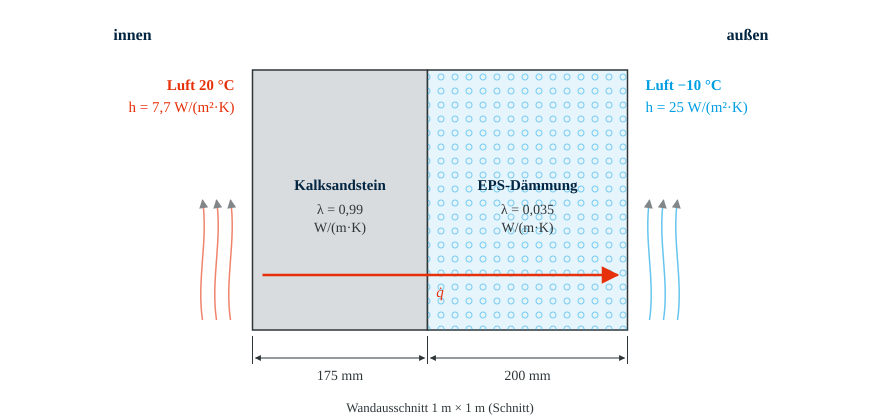
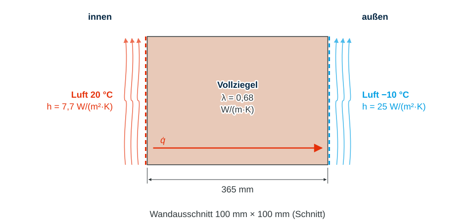
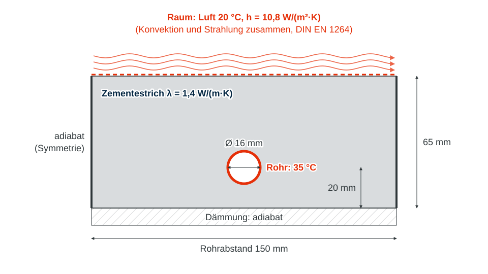

# Einführung in ANSYS Workbench

!!! abstract "Lernziele"

    - [ ] Grundprinzip der Finite-Elemente-Methode für die **Wärmeleitung** kennenlernen (`Grundlagen`)
    - [ ] Die **7 Schritte** einer stationären thermischen Analyse in ANSYS Workbench durchlaufen (`Vorzeigebeispiel`)
    - [ ] Ergebnisse mit einer **Handrechnung** auf Plausibilität prüfen (`Analytische Lösung`)
    - [ ] Den Ablauf an weiteren Wandaufbauten **selbstständig** wiederholen (`Übung 1 bis 3`)

## Inhalte

  <a class="prakt-card" href="01_Grundlagen/Grundprinzipien-FEM/">
    
    
      Grundprinzip der FEM
      Knoten, Elemente, Temperatur als Unbekannte
    
  </a>
  <a class="prakt-card" href="01_Grundlagen/Simulationssoftware/">
    
    
      Simulationssoftware
      ANSYS Workbench, Steady-State Thermal
    
  </a>
  <a class="prakt-card" href="02_Vorzeigebeispiel/Aussenwand/">
    
    
      Vorzeigebeispiel
      Außenwand mit Wärmedämmung, U-Wert
    
  </a>
  <a class="prakt-card" href="03_Selbsttests/Uebung-1/">
    
    
      Übung 1
      Mehr Dämmung
    
  </a>
  <a class="prakt-card" href="03_Selbsttests/Uebung-2/">
    
    
      Übung 2
      Altbau ohne Dämmung
    
  </a>
  <a class="prakt-card" href="03_Selbsttests/Uebung-3/">
    
    
      Übung 3
      Sanierung nach GEG
    
  </a>

