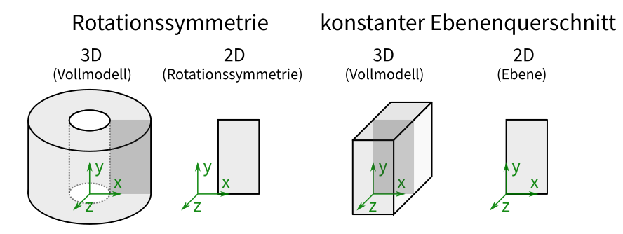
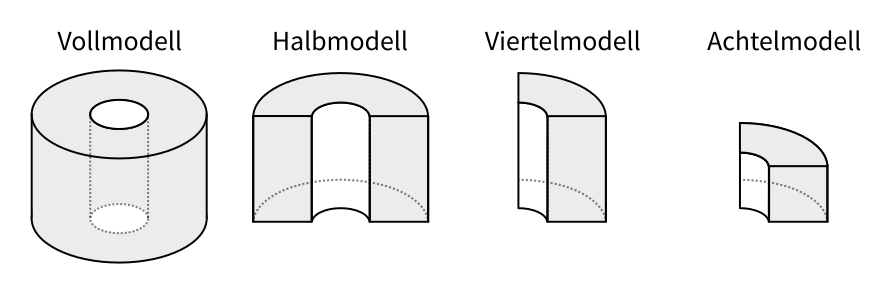
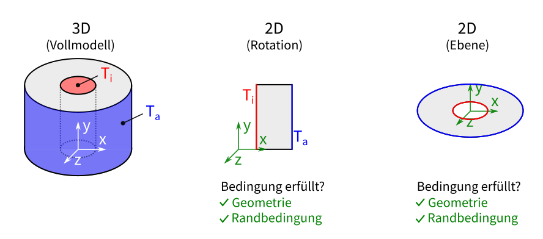
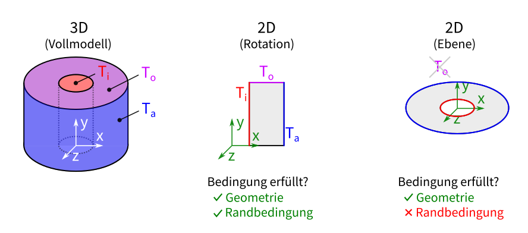

# 2D-Abstraktionen und Symmetrie

## Möglichkeiten zur Reduzierung der Rechenzeit

Je größer das Simulationsmodell und je mehr Freiheitsgrade eine Simulation
hat, umso länger ist auch die Zeit, die zur Berechnung notwendig ist. Gerade
wenn transiente Probleme gelöst werden und jeder Zeitschritt berechnet wird,
kann sich die Einsparung an Rechenzeit schnell aufsummieren. Grundsätzlich
gibt es zwei Möglichkeiten, dies zu erreichen:

1. **Reduzierung der Modellgröße durch Abstraktionen**
   (z.B. Ausnutzung von Symmetrien)

    **(+)** kein Verlust der Genauigkeit, wenn die Bedingungen erfüllt sind

2. **Reduzierung der Freiheitsgrade** (weniger Elemente/Knoten)

    **(−)** Je weniger Freiheitsgrade, desto geringer die Genauigkeit der
    Ergebnisse (Optimierungsproblem zwischen Rechenzeit und Genauigkeit)

## Abstraktionen (Modellvereinfachungen)

Die Möglichkeiten der Abstraktion lassen sich grob in zwei Gruppen teilen:

**1. Reduzierung der Dimension (3D → 2D)**

**2. Ausnutzung von Symmetrieebenen** (Halb-, Viertel-, Achtelsymmetrie)

Für beide Abstraktionen ist es wichtig, dass die **Geometrie** und die
**Randbedingungen** die **Bedingungen zur Abstraktion erfüllen**. So kann es
sein, dass die Geometrie die Bedingung für ein Viertelmodell erfüllt, die
Randbedingung jedoch nicht. Dazu zwei Beispiele:

Im **ersten Beispiel** erfüllt die Geometrie die Bedingung für beide Fälle
(Rotation + Ebene) und auch die Randbedingungen können sowohl im Fall der
**2D-Rotation** als auch im **2D-Ebenen**-Fall angebracht werden.

Im **zweiten Beispiel** wird an der oberen Fläche des Rohres eine **weitere
Temperatur eingeführt**, die in der **2D-Rotation** ebenfalls **angebracht
werden kann**. In der **2D-Ebene ist dies nicht möglich**: Die Temperatur
kann hier nur in der Ebene verlaufen, nicht jedoch aus dieser Ebene heraus,
wie es die Randbedingung der oberen Temperatur fordert.

Im Folgenden wird ein Beispiel mit einem Vollmodell (3D) und Abstraktionen
durchgerechnet und die Ergebnisse verglichen:
[Vorzeigeaufgabe: Rohr mit stationärer Wärmeleitung](Rohr/index.md)
