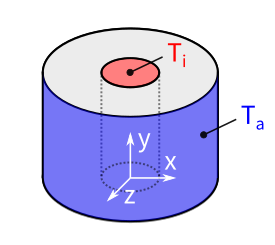
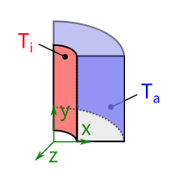
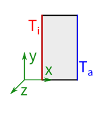

# Vorzeigeaufgabe: Rohr mit stationärer Wärmeleitung

!!! question "Die Aufgabe"
    Für ein Rohr mit heißer Innen- und kalter Außenfläche den
    **Temperaturverlauf** und die **Wärmestromdichte von innen nach außen**
    bestimmen — auf drei Wegen, um den Effekt von **Abstraktionen** zu sehen:

    - **a)** Vollmodell (3D)
    - **b)** Viertelmodell (3D)
    - **c)** Rotationssymmetrie (2D)

## Gegeben

| | |
|---|---|
| **Geometrie** | Länge 20 mm · Innen-Ø 10 mm · Außen-Ø 30 mm |
| **Material** | Baustahl, $\lambda=60{,}5 \,\mathrm{\frac{W}{K\,m}}$ (isotrop) |
| **Innenfläche** | $T_{innen}=100\,\mathrm{°C}$ |
| **Außenfläche** | $T_{außen}=20\,\mathrm{°C}$ |
| **Einheitensystem** | Metric (mm, kg, N, s, mV, mA) |

## Die drei Lösungswege

-   <a class="card-link" href="01-material/">
    __a) Vollmodell (3D)__ — der komplette Workflow in 7 Schritten
    <figure style="text-align:center;"></figure>
    </a>

-   <a class="card-link" href="b-viertelmodell/">
    __b) Viertelmodell (3D)__ — Abstraktion per Symmetrie
    <figure style="text-align:center;"></figure>
    </a>

-   <a class="card-link" href="c-rotationssymmetrie/">
    __c) Rotationssymmetrie (2D)__ — Abstraktion per Dimensionsreduktion
    <figure style="text-align:center;"></figure>
    </a>

-   <a class="card-link" href="vergleich/">
    __Vergleich__ — gleiche Ergebnisse, 10× schneller?
    </a>

Empfohlene Reihenfolge: **a → b → c → Vergleich**. Los geht's mit
[Schritt 1: Material](01-material.md).
