# Vorzeigeaufgabe: Rohr mit stationärer Wärmeleitung (Abstraktionen)

Zur Verdeutlichung dient ein einfaches Beispiel mit einem Rohr und jeweils
einer Temperatur auf der Innen- und Außenfläche.

!!! info
    Die folgenden Tutorials wurden im **Einheitensystem Metric
    (mm, kg, N, s, mV, mA)** erstellt.

## Aufgabenstellung

!!! question "Aufgabe"
    Eine „Steady-State Thermal"-Analyse in ANSYS Workbench hinzufügen und
    unter Berücksichtigung der gegebenen Geometrie, Materialien und
    Randbedingungen ein Finite-Elemente-Modell erstellen.

    Den **Temperaturverlauf und die Wärmestromdichte von der Innenfläche bis
    zur Außenfläche** für die folgenden drei Fälle a) bis c) bestimmen:

**a)** ohne Abstraktion als **Vollmodell in 3D**

**b)** mit Abstraktion als **Viertelmodell in 3D**

**c)** mit Abstraktion durch Ausnutzung der **Rotationssymmetrie in 2D**

## Gegeben

**Maße:**

- Länge l (y): 20 mm
- Innendurchmesser (x): 10 mm
- Außendurchmesser (x): 30 mm

**Material:** Baustahl

- isotrope Wärmeleitfähigkeit (*Isotropic Thermal Conductivity*)

$$
\lambda=60{,}5 \,\mathrm{\frac{W}{K\,m}}
$$

**Randbedingungen:**

- Außenfläche, konstante Temperatur: $T_{außen}=20\,\mathrm{°C}$
- Innenfläche, konstante Temperatur: $T_{innen}=100\,\mathrm{°C}$

## Aufgabe a) ohne Abstraktion: Vollmodell (3D)

- ANSYS Workbench öffnen und das Projekt speichern
- Eine neue Steady-State-Thermal-Analyse hinzufügen und in
  „a) Vollmodell (3D)" umbenennen

**1. Materialdefinition (Workbench)**

- **Keine Aktion erforderlich**, da das Standardmaterial (Structural Steel)
  verwendet werden kann.

**2. Geometrieerstellung (SpaceClaim)**

- Die Geometrie in SpaceClaim erstellen

[KLICK-TUTORIAL: Rohr erzeugen und teilen](http://ior.ad/6Z4k){target=_blank}

[:material-download: Rohr_3D_geviertel.scdoc](files/Rohr_3D_geviertel.scdoc)

**3. Materialzuweisung (Mechanical)**

- Ins **Workbench-Projektmenü** zurückgehen
- (**Workbench**) **Rechtsklick Model → Update** (Geometrie wird ins
  Mechanical geladen)
- (**Workbench**) **Rechtsklick Model → Edit** (Mechanical wird geöffnet)
- (**Mechanical**) Zur Materialzuweisung ist keine Aktion erforderlich, da
  das Standardmaterial (Structural Steel) verwendet wird.

**4. Vernetzung (Mechanical)**

- keine Aktionen erforderlich

So sollte das Standardnetz aussehen (durch die Teilung in 4 Teile wurde die
Geometrie bereits optimal vernetzt und mit einer Standardnetzgröße versehen):

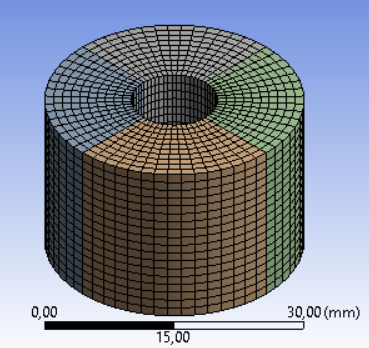

**5. Randbedingungen (Mechanical)**

- **Temperatur 20 °C** auf der **Außenfläche** anbringen
- **Temperatur 100 °C** auf der **Innenfläche** anbringen

??? tip "Kurzanleitung: Temperatur auf Fläche(n) anbringen"
    1. Mit dem **Flächenauswahltool** die **Fläche(n) auswählen**, auf die
       die Randbedingung angebracht werden soll
        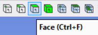
        - Selektion mehrerer Geometrien: **STRG gedrückt halten** vor der
          Geometrieauswahl
        - Drehen der Ansicht: **mittlere Maustaste gedrückt halten +
          Mausbewegung**
        - Verschieben der Ansicht: **mittlere Maustaste + STRG gedrückt
          halten + Mausbewegung**
    2. **Steady-State Thermal** im **Strukturbaum** auswählen
    3. Reiter **Environment** → **Temperature** anklicken
        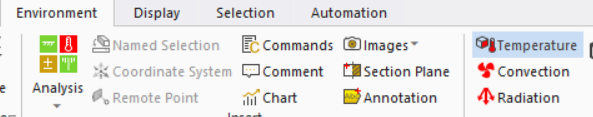
    4. Im Detailfenster den Temperaturwert eintragen
        - Unter Geometry sollte die Anzahl der ausgewählten Flächen stehen
        - Magnitude: Wert der Temperatur eingeben
        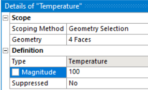
    5. Randbedingung sinnvoll umbenennen, z.B. Innenseite (100 °C) /
       Außenseite (20 °C)
        - Rechtsklick auf die Randbedingung im Strukturbaum → Rename
          (oder Anklicken und F2)

[KLICK-TUTORIAL mit Randbedingungen (auch Temperatur) aus dem ersten Praktikum](http://ior.ad/6XAi){target=_blank}

So sollten die **Randbedingungen** aussehen (Klick auf Steady-State Thermal
im Strukturbaum):

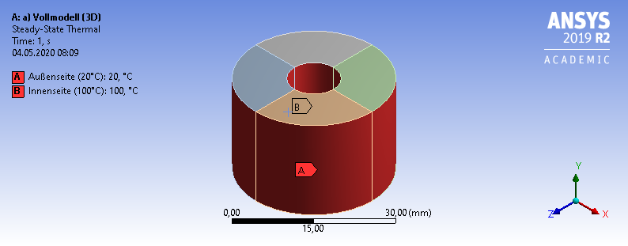

**6. Lösungseinstellungen (Mechanical)**

- keine spezielle Lösungseinstellung erforderlich
- Lösen der Simulation durch Klicken des Solve-Buttons im oberen Menü
  (Reiter Home) — alternativ Rechtsklick auf Steady-State Thermal im
  Strukturbaum → Solve

**7. Lösungsdarstellung (Mechanical)**

- **Temperatur** von Innen- zur Außenfläche darstellen (Pfad)
- **Wärmestromdichte (Total Heat Flux)** von Innen- zur Außenfläche
  darstellen (Pfad)

    **Hinweise:**

    - Für die Wärmestromdichte statt Temperature → Total Heat Flux auswählen
    - Bei der zweiten Erstellung des Pfades nicht über „Convert to Path
      Result" (4. Schritt in der Kurzanleitung), sondern im Detailfenster
      **Scoping Method → Path** und bei **Path** den vorhandenen Pfad
      auswählen

??? tip "Kurzanleitung: Temperaturdarstellung als Pfad"
    1. **Kantenauswahltool** auswählen
        
    2. Eine beliebige Kante auswählen, die von der Innen- zur Außenseite
       verläuft (grün markiert)
        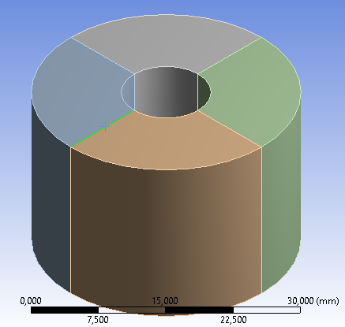
    3. Rechtsklick Solution (im Strukturbaum) → Insert → Thermal →
       Temperature
        
    4. Rechtsklick auf Temperature (im Strukturbaum) → Convert to Path Result
        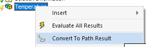
    5. Rechtsklick auf Solution (im Strukturbaum) → Evaluate All Results
        

[KLICK-TUTORIAL mit Lösungsdarstellung aus dem ersten Praktikum](http://ior.ad/6XCx){target=_blank}

So sollte die **Lösung** aussehen:

- **Verlauf der Temperatur** von der Außenwand zur Innenwand

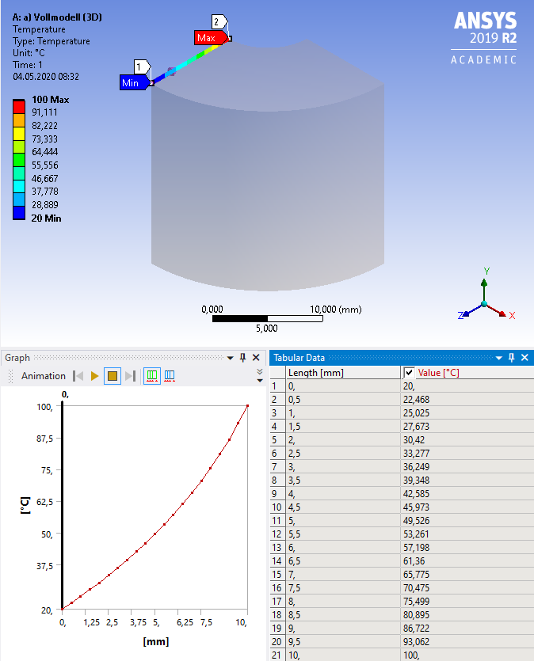

- **Verlauf der Wärmestromdichte** von der Außenwand zur Innenwand

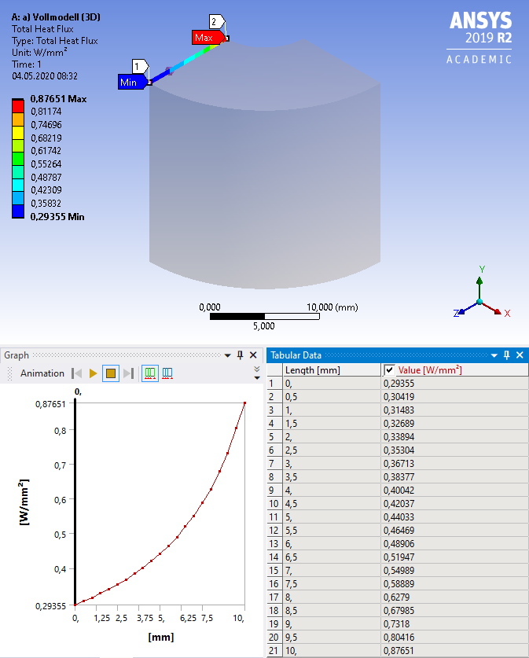

## Aufgabe b) mit Abstraktion: Viertelmodell (3D)

Hierbei kann die vorherige Analyse verwendet und nur leicht geändert werden,
es muss also nicht der komplette Ablauf durchlaufen werden. Wie dies
funktioniert, zeigt das folgende Klick-Tutorial:

[KLICK-TUTORIAL: Viertelmodell](http://ior.ad/6Z4K){target=_blank}

So sollte die **Lösung** aussehen:

- **Verlauf der Temperatur** von der Außenwand zur Innenwand

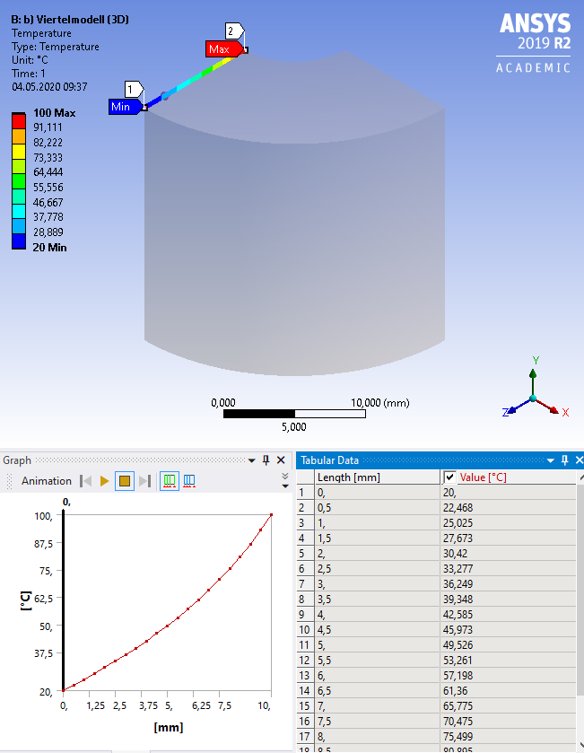

- **Verlauf der Wärmestromdichte** von der Außenwand zur Innenwand

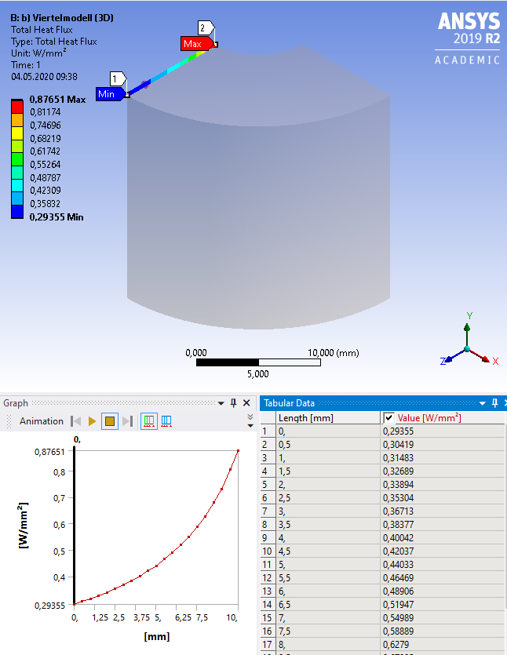

## Aufgabe c) mit Abstraktion: Rotationssymmetrie (2D)

- Eine neue Steady-State-Thermal-Analyse hinzufügen und in
  „c) Rotationssymmetrie (2D)" umbenennen

**1. Materialdefinition (Workbench)**

- **Keine Aktion erforderlich**, da das Standardmaterial (Structural Steel)
  verwendet werden kann.

**2. Geometrieerstellung (SpaceClaim)**

- Die Geometrie in SpaceClaim erstellen

!!! warning "Wichtige Änderung für Rotationssymmetrie (2D) gegenüber 3D"
    **Workbench-Projektmenü:**
    Rechtsklick Geometry → Properties → Analysis Type → 2D

    **SpaceClaim:**
    Die Skizze für die Rotationssymmetrie muss auf der x-y-Ebene erstellt
    werden (**y-Achse ist die Rotationsachse**, **Zeichnung in positiver
    x-y-Richtung**).

[KLICK-TUTORIAL: Rohr als Rotationssymmetrie 2D](http://ior.ad/6Z4P){target=_blank}

[:material-download: Rohr_2D_RotSym.scdoc](files/Rohr_2D_RotSym.scdoc)

**3. Materialzuweisung (Mechanical)**

- Ins **Workbench-Projektmenü** zurückgehen
- (**Workbench**) **Rechtsklick Model → Update**
- (**Workbench**) **Rechtsklick Model → Edit**
- (**Mechanical**) Klick auf Geometry (im Strukturbaum) → im Detailfenster
  2D Behavior → **Axisymmetric**

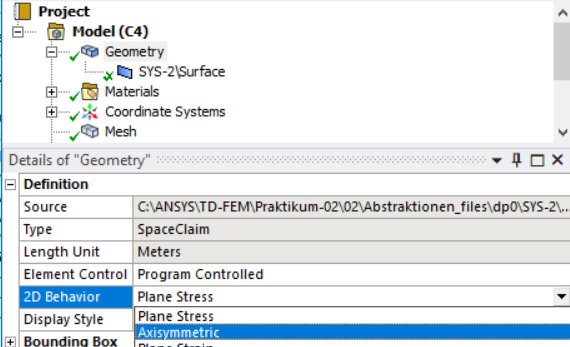

- (**Mechanical**) Zur Materialzuweisung ist keine Aktion erforderlich, da
  das Standardmaterial (Structural Steel) verwendet wird.

**4. Vernetzung (Mechanical)**

- Um das Ergebnis mit dem 3D-Modell zu vergleichen, wird die gleiche
  Elementgröße eingestellt
- Strukturbaum Mesh auswählen → Detailfenster: Element Size: 1 mm
  (**Einheiten beachten!**)

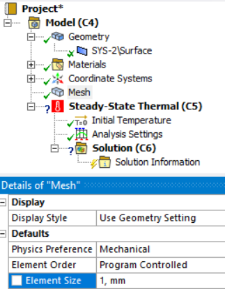

- Strukturbaum Mesh Rechtsklick → Generate Mesh

So sollte das finale Netz aussehen:

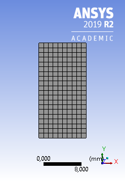

**5. Randbedingungen (Mechanical)**

- **Temperatur 20 °C** auf der **Außenfläche** anbringen
- **Temperatur 100 °C** auf der **Innenfläche** anbringen

!!! info
    Da Innen- und Außenfläche durch die Rotationssymmetrie zu Kanten
    geworden sind, müssen die Randbedingungen nun auf die Kanten statt auf
    Flächen angebracht werden.

??? tip "Kurzanleitung: Temperatur auf Kante(n) anbringen"
    1. Mit dem **Kantenauswahltool** die **Kante(n) auswählen**, auf die die
       Randbedingung angebracht werden soll
        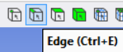
    2. **Steady-State Thermal** im **Strukturbaum** auswählen
    3. Reiter **Environment** → **Temperature** anklicken
        
    4. Im Detailfenster den Temperaturwert eintragen
        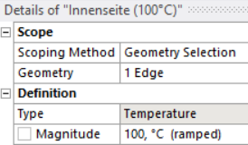
    5. Randbedingung sinnvoll umbenennen, z.B. Innenseite (100 °C) /
       Außenseite (20 °C)

So sollten die Randbedingungen final aussehen:

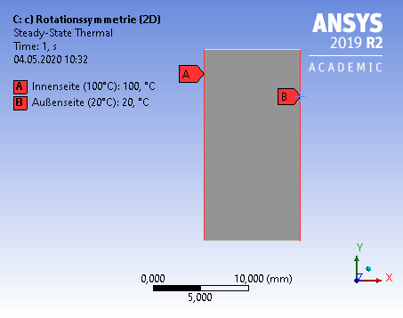

**6. Lösungseinstellungen (Mechanical)**

- keine spezielle Lösungseinstellung erforderlich; Lösen über den
  Solve-Button

**7. Lösungsdarstellung (Mechanical)**

- **Temperatur** und **Wärmestromdichte (Total Heat Flux)** von der Innen-
  zur Außenfläche als Pfad darstellen (Kurzanleitung siehe Aufgabe a; als
  Pfadkante eine Kante wählen, die von innen nach außen verläuft)

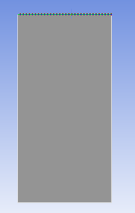

So sollte die **Lösung** aussehen:

- **Verlauf der Temperatur** von der Außenwand zur Innenwand

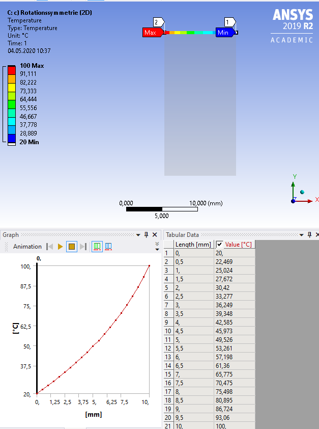

- **Verlauf der Wärmestromdichte** von der Außenwand zur Innenwand

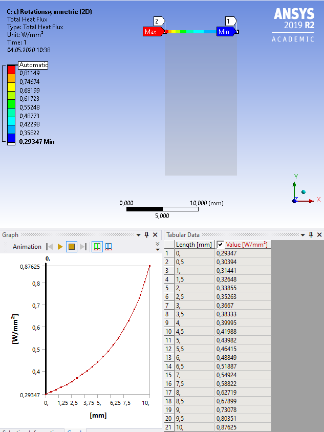

## Vergleich der Abstraktionen

Wie zu erwarten, zeigt sich zwischen den Modellen kein Unterschied im
Ergebnis:

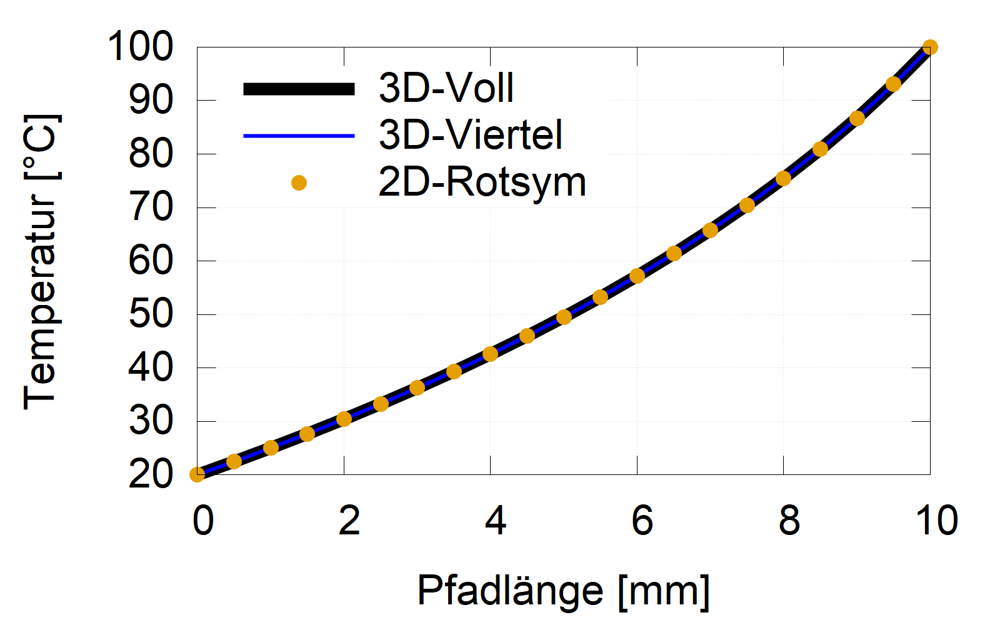

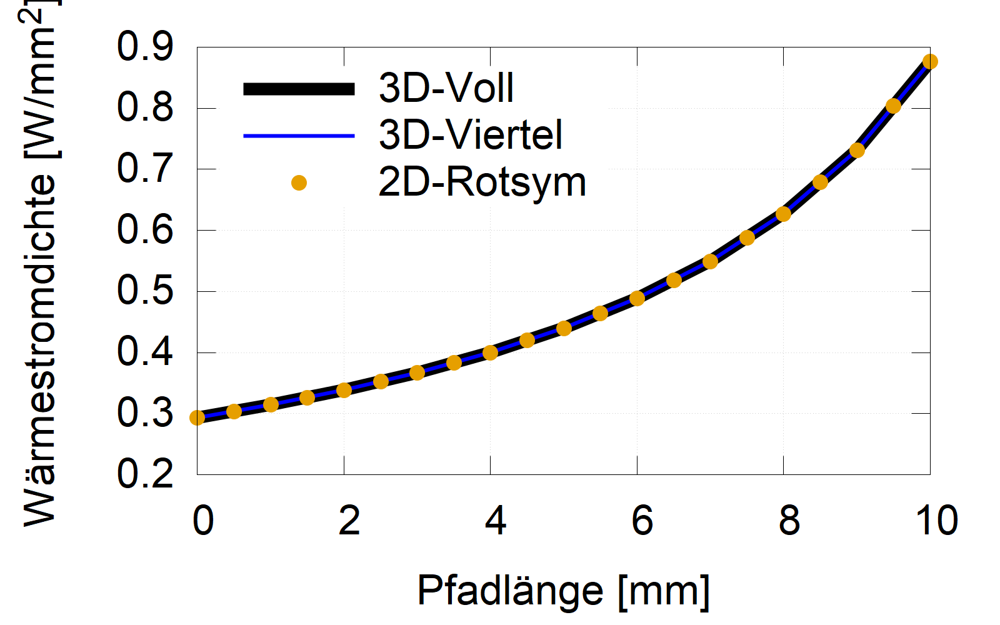

Betrachtet man jedoch die Berechnungszeit, zeigen sich deutliche
Unterschiede:

- a) 3D-Vollmodell: **3,8 s**
- b) 3D-Viertelmodell: **0,9 s**
- c) 2D-Rotationssymmetrie: **0,4 s**

??? note "Für Neugierige: Wo findet man die Berechnungszeit?"
    `Solution Information` → `Solver Output`

    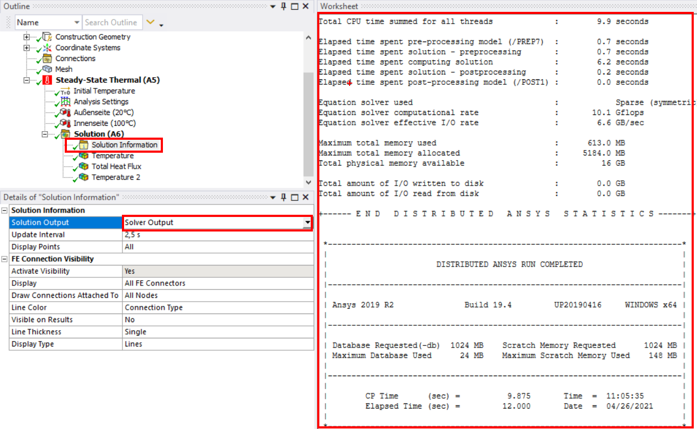

    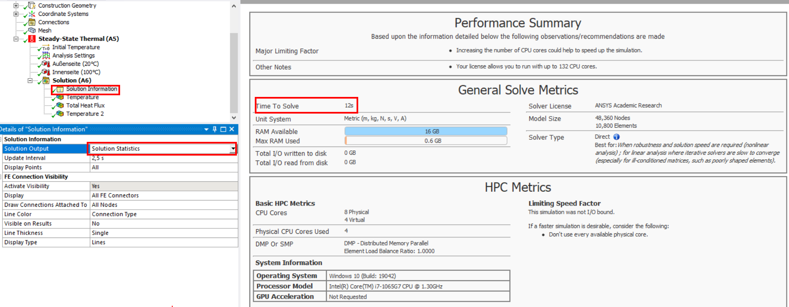

!!! success "Merke"
    **Abstraktionen** erreichen die **gleiche Genauigkeit** bei **stark
    reduzierter Rechenzeit** — sie sollten also, wann immer möglich,
    angewendet werden.
