# Beispielaufgabe: Heat Transfer in Fins

Unter
[demonstrations.wolfram.com/HeatTransferInFins](https://demonstrations.wolfram.com/HeatTransferInFins/){target=_blank}
wird von Mathematica ein Demonstrationsbeispiel für die Dimensionierung von
Kühlgeometrien zur Verfügung gestellt.

Unter dem **Snapshot 1** ist ein Beispiel mit einer **500-K-Wärmequelle**,
einem **18 mm** langen **Eisenstab** mit einem **Durchmesser** von
**1,5 mm** und einer **Strömung quer zum Stab** mit einer
**Fluidtemperatur** von **348 K** dargestellt.

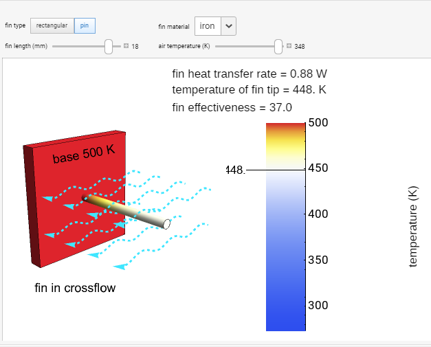

Ziel ist es, die **Randbedingungen** in ANSYS so zu finden, dass sich die
gleichen Werte der **Temperatur** an der **Stabspitze (T=448 K)** und der
**Wärmeabgabe** von **Q=0,88 W** ergeben.

Die Aufgabe soll möglichst eigenständig bearbeitet werden; es werden jedoch
immer Lösungshinweise gegeben, um am Ende auf das richtige Modell zu kommen.

!!! info
    Die Aufgabe wurde im **Einheitensystem Metric** (**m**, kg, N, s, mV,
    mA, **K**) mit **Längen** in **mm** und **Temperaturen** in **K**
    erstellt.

Die Einheiten können im **Mechanical** unten in der blauen Leiste geändert
werden:

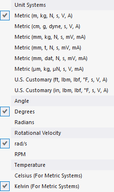

## Aufgabenstellung

!!! question "Aufgabe"
    Eine „Steady-State Thermal"-Analyse in ANSYS Workbench hinzufügen und
    unter Berücksichtigung der gegebenen Geometrie, Materialien und
    Randbedingungen ein 3D-Finite-Elemente-Modell erstellen.

    **a)** **Randbedingungen so wählen**, dass die **Temperatur** an der
    **Spitze 448 K** entspricht.

    **b)** Die **Wärmeabgabe bestimmen** und den Wert mit der Lösung von
    **Q=0,88 W** kontrollieren.

## Gegeben

**Maße:**

- Durchmesser Stab (x, z): 1,5 mm
- Länge Stab (y): 18 mm

**Material:** stainless steel

- isotrope Wärmeleitfähigkeit (*Isotropic Thermal Conductivity*)

$$
\lambda=80 \,\mathrm{\frac{W}{K\,m}}
$$

**Randbedingungen:** sollen nach Aufgabenstellung bestimmt werden …

## Bearbeitung

- **ANSYS Workbench** öffnen und das **Projekt speichern**
- Eine neue **Steady-State-Thermal-Analyse** hinzufügen und umbenennen

**1. Materialdefinition (Workbench)**

- Das gegebene Material mit den jeweiligen Materialparametern hinzufügen

    [KLICK-TUTORIAL: Material selbst definieren (aus Praktikum 1)](http://ior.ad/6XCq){target=_blank}

??? success "Lösung"
    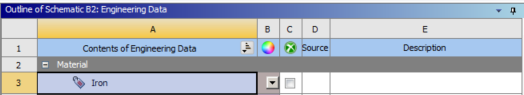

    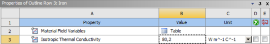

**2. Geometrieerstellung (SpaceClaim)**

- Die notwendige Geometrie erstellen

    [KLICK-TUTORIAL: Rohr erzeugen (aus Praktikum 2)](http://ior.ad/6Z4k){target=_blank}

??? success "Lösung"
    - Es ist **nur der Stab zu modellieren**, da die Temperatur des
      Heizkörpers an der Grenzfläche angebracht werden kann
    - Länge 18 mm, Durchmesser 1,5 mm

    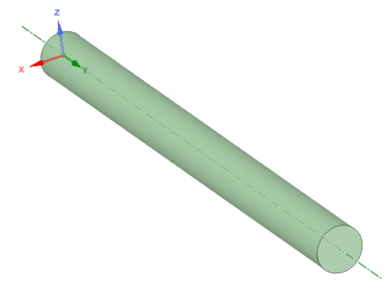

    [:material-download: Stab-18mm.scdoc](files/Stab-18mm.scdoc)

**3. Materialzuweisung (Mechanical)**

- Der Geometrie das erstellte Material zuweisen

    [KLICK-TUTORIAL: Material zuweisen (aus Praktikum 1)](http://ior.ad/6Xg7){target=_blank}

??? success "Lösung"
    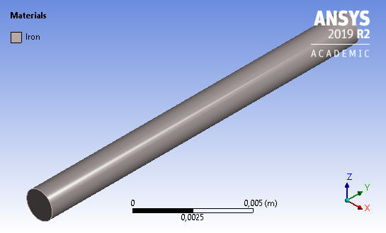

**4. Vernetzung (Mechanical)**

- Das Bauteil vernetzen und eine geeignete Netzgröße wählen

??? success "Lösung"
    - Automatische Vernetzung mit 0,0002 m Elementgröße

    

**5. Randbedingungen (Mechanical)**

- Geeignete Randbedingungen wählen (siehe Aufgabenstellung)
- Die Parameter prüfen, indem die **Temperatur** auf der **Stabspitze**
  ausgewertet wird — sie sollte **448 K** entsprechen
- Ggf. in die [Übersicht der Randbedingungen](Randbedingungen.md) schauen

??? success "Lösung"
    - Temperatur auf der vorderen Stirnfläche: T=500 K

        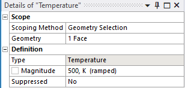

    - Konvektion auf der Mantelfläche
      ($\alpha=88{,}4\,\mathrm{\frac{W}{m^2 K}}$, $T_{ambient}=348\,\mathrm{K}$)

        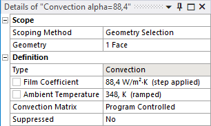

    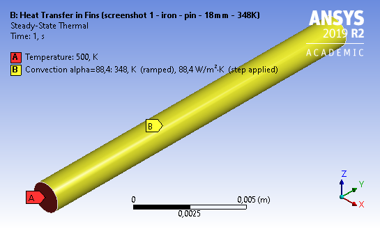

**6. Lösungseinstellungen (Mechanical)**

- keine spezielle Lösungseinstellung erforderlich; Lösen über den
  Solve-Button (Reiter Home) — alternativ Rechtsklick auf Steady-State
  Thermal im Strukturbaum → Solve

**7. Lösungsdarstellung (Mechanical)**

- Die Temperatur an der Stabspitze bestimmen

  
<strong>Frage:</strong> Welche Temperatur (in K) stellt sich an der Stabspitze ein?

??? success "Lösung Temperatur"
    Hier die Temperatur auf der gesamten Probe. Die Temperatur an der
    Spitze entspricht dem Minimum:

    $$
    T_{Spitze}=448{,}3\,\mathrm{K}
    $$

    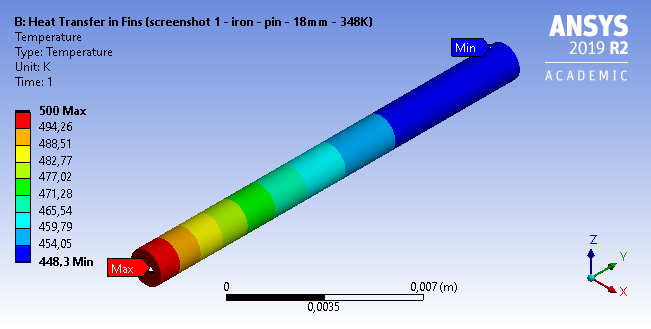

    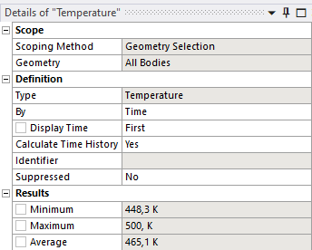

- Die Wärmeabgabe bestimmen (Lösung: 0,88 W)

??? success "Lösung Wärmeabgabe"
    Die abgegebene Wärme kann über zwei Varianten bestimmt werden (mehr dazu
    in der Diskussion):

    - **Wärmestrom aus der Wärmequelle** (einfach)
    - Wärmestrom über die Mantelfläche ins „Fluid" (mehr Aufwand, da hier
      richtungsabhängig ausgewertet werden muss — siehe Kapitel
      [Postprocessing](Postprocessing.md))

    Zunächst der Wärmestrom aus der Wärmequelle:

    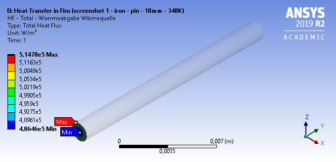

    Der mittlere Wert liegt hier bei

    $$
    {\widehat{\dot q}}_{Mittel}=4{,}957\cdot10^{5} \,\mathrm{\frac{W}{m^2}}
    $$

    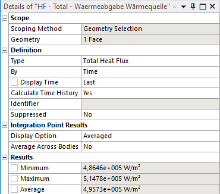

    Nun muss der Wert nur noch mit der Querschnittsfläche multipliziert
    werden. Diese kann in ANSYS abgelesen werden:

    - Auswahl im Strukturbaum: Geometry
    - Flächenauswahltool wählen und die zu messende Fläche anklicken

        

        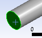

    - Wert im unteren Fenster „Selection Information" ablesen (ggf. Tab
      umschalten)

        

        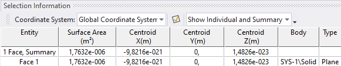

        Fläche unter Face 1 → $A=1{,}76\cdot10^{-6}\,\mathrm{m^2}$

    Berechnung der Wärme:

    $$
    Q_{Kreisfläche}={\widehat{\dot q}}_{Mittel}\cdot A_{Querschnitt}=4{,}957\cdot10^{5} \,\mathrm{\frac{W}{m^2}}\cdot1{,}76\cdot10^{-6}\,\mathrm{m^2}=0{,}87 \,\mathrm{W}
    $$

## Diskussion

Im Vorzeigebeispiel wurden folgende Randbedingungen gewählt:

1. Temperatur auf der Stirnfläche zur Wärmequelle (T=500 K)
2. Konvektion auf der Mantelfläche des Stabes

Weiterhin könnte man noch die Konvektion auf der offenen Stirnseite
hinzufügen sowie die Wärmestrahlung des Stabes. Dadurch würde die Temperatur
am Stabende noch einmal um 7,4 K gesenkt werden:

1. Konvektion (Mantelfläche): T=448,3 K
2. Konvektion (Mantelfläche + Stirnseite): T=446,8 K
3. Konvektion (Mantelfläche + Stirnseite) + Strahlung: T=440,9 K

Durch Änderung der Geometrie, des Materials oder der Fluidtemperatur lassen
sich auch die anderen Beispiele aus
[demonstrations.wolfram.com/HeatTransferInFins](https://demonstrations.wolfram.com/HeatTransferInFins/){target=_blank}
nachrechnen — zum Üben ausdrücklich empfohlen.

Weiterhin ist anzumerken, dass besonders die Auswertung des Wärmestroms, der
aus dem Bauteil herausgeht, in einem FEM-Modell manchmal nicht trivial ist.
Im oberen Beispiel wurde dies gelöst, indem der Wärmestrom ausgewertet
wurde, der direkt von der Wärmequelle kam (Fläche mit der Randbedingung
500 K). Soll der Wärmestrom ausgewertet werden, der die Mantelfläche
senkrecht verlässt, muss dies gesondert eingestellt werden: Die Auswertung
über Total Heat Flux gibt die Vektorsumme an und ist für diesen Zweck
ungeeignet. Wie die gerichtete Auswertung der Wärmestromdichte senkrecht zur
Mantelfläche funktioniert, wird im folgenden Kapitel zum
[Postprocessing](Postprocessing.md) erklärt.
