# Postprocessing

## Gerichtete Wärmestromdichte in Zylinderkoordinaten (mit Beispielaufgabe Fins)

Ziel ist es, die Wärmestromdichte zu bestimmen, die **senkrecht** zur
**Mantelfläche** den Eisenstab (aus der
[Beispielaufgabe Fins](Beispiel-Fins.md)) verlässt. Dazu muss ein
**Zylinderkoordinatensystem** angelegt und in **radialer Richtung
ausgewertet** werden. Wie dies geschieht, zeigt folgendes Klick-Tutorial:

[KLICK-TUTORIAL: gerichtete Auswertung im Zylinderkoordinatensystem](http://ior.ad/70TL){target=_blank}

Mit der Mantelfläche des Stabes lässt sich nun die Wärmeabgabe berechnen:

$$
Q_{Mantelfläche}={\widehat{\dot q}}_{Mittel,Mantelfläche}\cdot A_{Mantelfläche}=10282\,\mathrm{\frac{W}{m^2}}\cdot8{,}47\cdot10^{-5}\,\mathrm{m^2}=0{,}87\,\mathrm{W}
$$

<!-- TODO(NEU): Abschnitt "Reaktionen an Randbedingungen" ergänzen —
     Reaction Probe an der RB auswerten (z.B. Reaktions-Wärmestrom an der
     Temperatur-RB im Fins-Beispiel), mit der Wärmestrom-Auswertung
     (q·A ≈ 0,87 W) vergleichen und diskutieren, warum Abweichungen
     auftreten (Reaktionen = konsistente Knotengrößen, Heat Flux =
     extrapoliertes Elementfeld → netzabhängig). -->

## Auswertungsarten

Generell können in der ANSYS-Steady-State-Analyse folgende Werte ausgegeben
werden:

1. **Temperature**
2. **Total Heat Flux** → Wärmestromdichte (Vektorsumme)
3. **Directional Heat Flux** → Wärmestromdichte (in eine Richtung)

Dies kann entweder durch **Rechtsklick** auf **Solution** erfolgen:

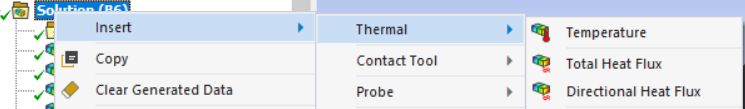

Oder durch **Auswählen** von **Solution** im **Strukturbaum** und den Reiter
**Solution** im **oberen Menü** unter dem Punkt **Thermal**:

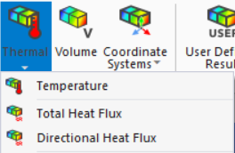

## Auswertungsgeometrien

Die Auswertung kann auf dem ganzen Körper (Standard) oder auf einzelnen
Teilen erfolgen, wobei die Geometrieauswahl analog zur Auswahl bei
Randbedingungen erfolgt (siehe
[Übersicht Randbedingungen](Randbedingungen.md)).

!!! tip "Geometrie einer bestehenden Auswertung ändern"
    Dazu kann entweder:

    1. die **Auswertung ohne Ergebnis dupliziert werden**
       (Rechtsklick → Duplicate without Results), oder
    2. das **Ergebnis entfernt werden**
       (Rechtsklick → Clear Generated Data)

Die Geometrie, auf der die Auswertung erfolgt, wird im Detailfenster unter
**Scoping Method** eingestellt:

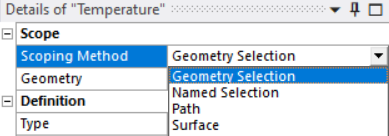

- Scoping Method: **Geometry Selection**
    - Punkte, Kanten, Flächen, Körper — über das jeweilige Auswahltool

- Scoping Method: **Named Selection**
    - Über „Rechtsklick auf Model → Named Selection" erstellen. Hierbei
      werden Geometrien unter einem Namen zusammengefasst — wichtig vor
      allem für Parameterstudien, bei denen sich Geometrien ändern, aber
      immer die gleichen Stellen ausgewertet werden sollen.

- Scoping Method: **Path**
    - Pfade können über zwei Varianten erstellt werden:
        1. Rechtsklick auf Model → Construction Geometry → Path — Definition
           über Geometriepunkte/-kanten oder Koordinaten (auch in selbst
           definierten Koordinatensystemen)
        2. Rechtsklick auf Auswertung → „Convert to Path Result" — der Pfad
           ist durch die jeweilige Kante bereits definiert

    ??? tip "Kurzanleitung: Auswertung auf Pfad"
        1. Rechtsklick Model → Insert → Construction Geometry → Path
            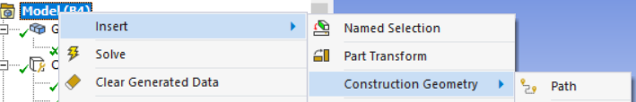
        2. Im Detailfenster des Pfades → Definition → Path Type → Two Points
        3. Im Detailfenster des Pfades → Path Coordinate System auswählen
        4. Im Detailfenster des Pfades → Start: Koordinatensystem und
           Koordinaten (x, y, z) des Startpunktes wählen
        5. Im Detailfenster des Pfades → End: Koordinatensystem und
           Koordinaten (x, y, z) des Endpunktes wählen
        6. Im Detailfenster der Auswertung → Scoping Method → Path
        7. Im Detailfenster der Auswertung → Path: definierten Pfad wählen
        8. Rechtsklick auf Solution (im Strukturbaum) → Evaluate All Results
            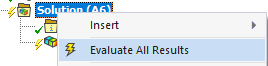

- Scoping Method: **Surface**
    - Erstellung: Rechtsklick auf Model → Construction Geometry → Surface.
      Die Geometrie wird durch Flächen geschnitten, die durch
      Koordinatensysteme definiert werden. Zwei Varianten:
        - Schnitt in der **x-y-Ebene** des gewählten **kartesischen**
          Koordinatensystems
        - Schnitt in der **Mantelfläche** mit **definiertem Radius** des
          gewählten **zylindrischen** Koordinatensystems

    ??? tip "Kurzanleitung: Auswertung auf Surface (kartesisches Koordinatensystem)"
        1. Rechtsklick Model → Insert → Construction Geometry → Surface
            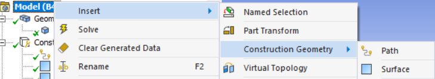
        2. Im Detailfenster des Surface → Definition → Coordinate System:
           kartesisches Koordinatensystem auswählen (ggf. vorher über
           Rechtsklick auf Coordinate Systems → Insert → Coordinate System
           anlegen). **Wichtig:** Der Schnitt liegt auf der x-y-Ebene des
           Koordinatensystems.
        3. Im Detailfenster der Auswertung → Scoping Method → Surface
        4. Im Detailfenster der Auswertung → Surface: definiertes Surface
           auswählen
        5. Im Detailfenster der Auswertung → Geometry: ggf. andere Geometrie
           wählen
        6. Rechtsklick auf Solution (im Strukturbaum) → Evaluate All Results
            

    ??? tip "Kurzanleitung: Auswertung auf Surface (zylindrisches Koordinatensystem)"
        1. Rechtsklick Model → Insert → Construction Geometry → Surface
            
        2. Im Detailfenster des Surface → Definition → Coordinate System:
           zylindrisches Koordinatensystem auswählen (ggf. vorher anlegen).
           **Wichtig:** Der Schnitt liegt im definierten Radius des
           zylindrischen Koordinatensystems.
        3. Im Detailfenster des Surface → Definition → Radius definieren
        4. Im Detailfenster der Auswertung → Scoping Method → Surface
        5. Im Detailfenster der Auswertung → Surface: definiertes Surface
           auswählen
        6. Im Detailfenster der Auswertung → Geometry: ggf. andere Geometrie
           wählen
        7. Rechtsklick auf Solution (im Strukturbaum) → Evaluate All Results
            

## Übungen am Vorzeigebeispiel

Im Vorzeigebeispiel (Fins) eine **Temperaturauswertung** mit einem **Pfad**
in der **Achse von der Wärmequelle zur anderen Spitze** erstellen
(Kurzanleitung „Auswertung auf Pfad" oben).

??? success "Lösung"
    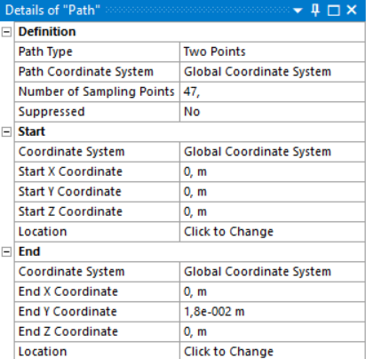

    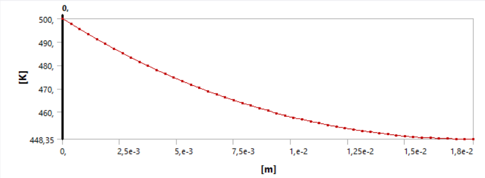

Im Vorzeigebeispiel eine **Temperaturauswertung** mit einem **Surface** mit
Schnitt im **Radius von 0,5 mm** erstellen (Kurzanleitung „zylindrisches
Koordinatensystem" oben).

??? success "Lösung"
    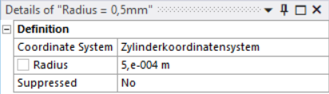

    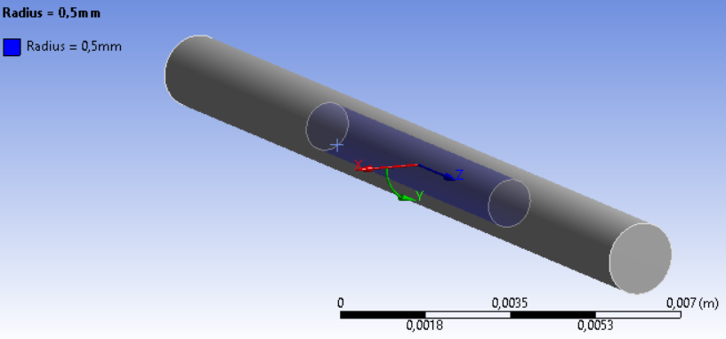

    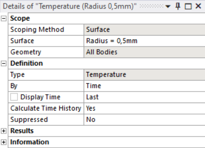

    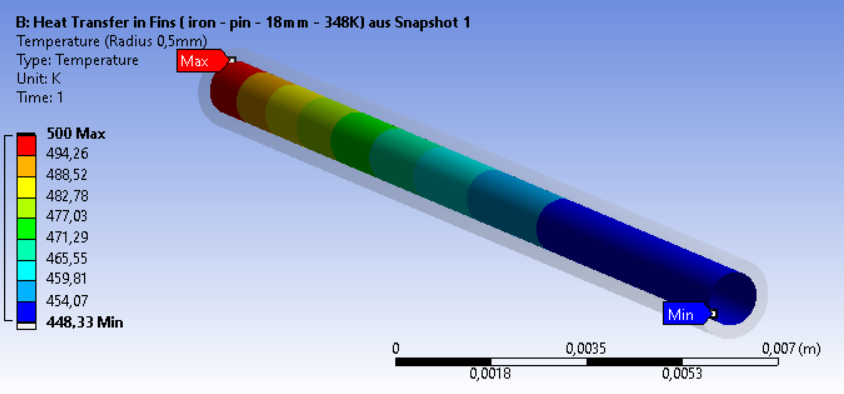

Im Vorzeigebeispiel eine in **radialer Richtung ausgewertete
Wärmestromdichte** mit einem **Surface** mit **Schnitt im Querschnitt in der
Mitte des Stabes** erstellen.

**Hinweis:** Die **Auswertung** erfolgt wie oben **im zylindrischen
Koordinatensystem**, nur das **Surface wird im kartesischen
Koordinatensystem definiert**.

??? success "Lösung"
    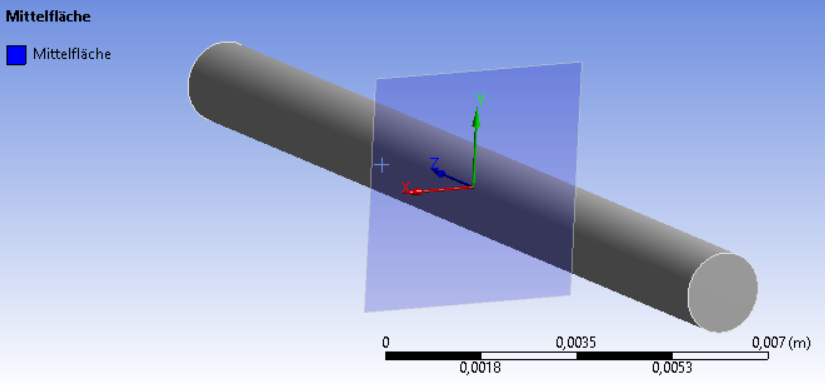

    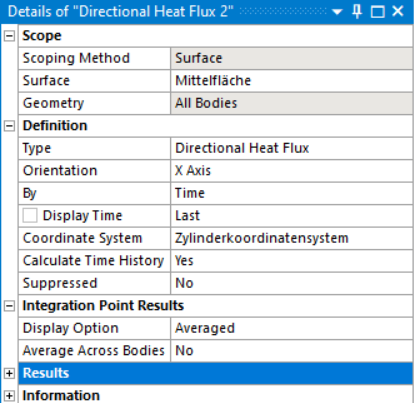

    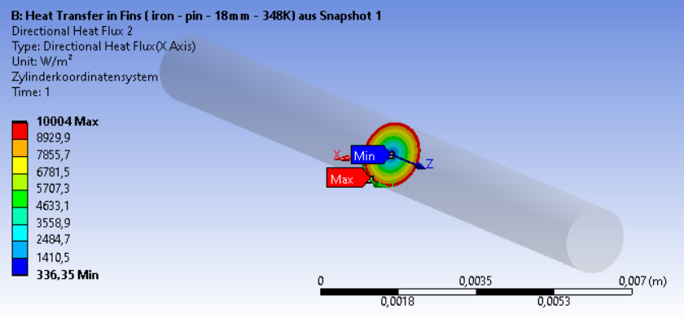

## Darstellungsmethoden

Durch **Auswählen** einer **Auswertung** (z.B. Temperatur) im
**Strukturbaum** gibt es im **Reiter Result** oben die **Möglichkeit**,
minimale bzw. maximale Werte darzustellen sowie durch Klicken auf die
Geometrie über **Probe** den Wert an dieser Stelle anzuzeigen.

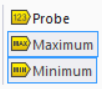

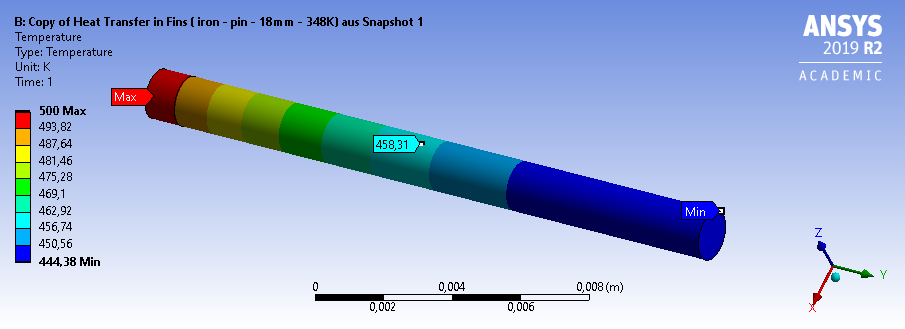

Im Fenster Graphics Annotations werden die mit Probe angezeigten Werte noch
einmal mit Koordinaten aufgelistet:

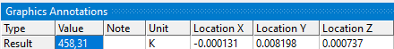

Für **vektorielle Größen** wie die **Wärmestromdichte** können diese auch
**als Vektor dargestellt werden**. Das ist besonders in unserem Beispiel
sinnvoll, um zu zeigen, wie der Wärmestrom auf der Oberfläche verläuft und
warum die Auswertung senkrecht zur Mantelfläche notwendig ist.

Dafür die Wärmestromdichte (Total Heat Flux) auf der Mantelfläche erstellen
und oben im Reiter Result unter Vector Display einschalten:

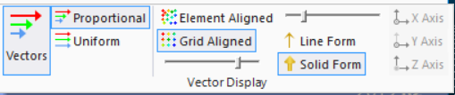

- **Proportionale** Darstellung ist oft sinnvoller, da größere Werte auch
  längere Vektoren ergeben
- **Grid Aligned** ist oft die bessere Wahl
- Mit den Schiebereglern etwas spielen, bis das Ergebnis gut erkennbar ist

Es zeigt sich, dass der Wärmestrom zum größten Teil in Richtung des
Stabendes gerichtet ist — deshalb wäre die Auswertung ohne radiale
Richtungsangabe für die Wärmeabgabe auch falsch:

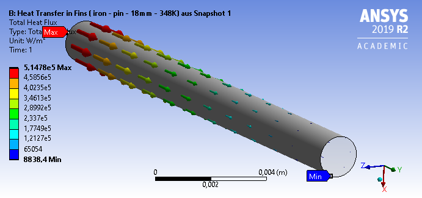
