# Übersicht Randbedingungen

Mit Hilfe der **Steady-State Thermal Analysis** (in ANSYS) können

- **Temperaturen**
- **Wärmeströme** (heat flow rates)
- **Wärmestromdichten** (heat fluxes)

auf einem Objekt bestimmt werden, die durch **thermische Lasten**
hervorgerufen werden, **die sich nicht über die Zeit ändern**.

Diese **thermischen Lasten** (Randbedingungen) sind:

- **Temperaturen** (konstant oder örtlicher Verlauf)
- **Konvektion** (Convection)
- **Strahlung** (Radiation)
- **Wärmestrom** (Heat Flow)
- **Wärmestromdichte** (Heat Flux)
    - mit dem Sonderfall **Isolierung**, für den die Wärmestromdichte auf
      Null gesetzt wird
- **Wärmeerzeugung** (Internal Heat Generation)

Die **Randbedingungen** müssen immer auf den **Knoten** des
Finite-Elemente-Netzes **angebracht werden**. Der Standardanwender in ANSYS
Workbench bringt die **Randbedingungen** jedoch auf einer **Geometrie**
(Punkt, Kante, Fläche oder Körper) auf. Intern werden die Randbedingungen
dann auf die auf der Geometrie liegenden Knoten verteilt. Es können jedoch
**Randbedingungen auch direkt** auf **Knoten** angebracht werden.

## Anbringen von Randbedingungen in ANSYS Mechanical

**Randbedingungen** können in ANSYS Mechanical über **drei verschiedene
Methoden angebracht werden**:

**1.** Über das **obere Menü** (Tab **Environment**, erscheint wenn
Steady-State Thermal im Strukturbaum ausgewählt wird)

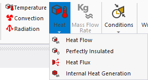

**2.** Über **Rechtsklick** im **Strukturbaum** auf **Steady-State Thermal**
→ **Insert**

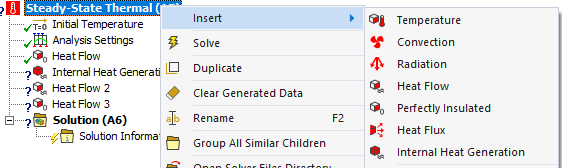

**3.** Über **Rechtsklick** im **Grafikfenster** auf die **ausgewählte
Geometrie → Insert**

**Hinweis:** Hier werden nur die Randbedingungen angezeigt, die auf der
gewählten Geometrie verfügbar sind. In diesem Beispiel ist z.B. Internal
Heat Generation nicht vorhanden, weil dies nur auf Körper (Volumen in 3D,
Flächen in 2D) angewandt werden kann.

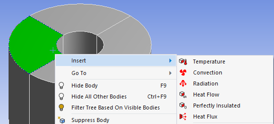

## Geometrieauswahl

Zu jeder Randbedingung muss eine Geometrie (Punkt, Kante, Fläche oder
Körper) ausgewählt werden. Dies erfolgt über das jeweilige Auswahltool.

Der **Zeitpunkt der Geometrieauswahl** führt zu folgenden Ergebnissen:

- **vor der Auswahl** der Randbedingung:
  die **Geometrie** ist dann **automatisch** mit der Randbedingung
  **verknüpft**
- **nach der Auswahl** der Randbedingung:
  die **Geometrie muss nachträglich** im Detailfenster der Randbedingung
  **festgelegt werden**

### Geometrie einer Randbedingung hinzufügen/verändern

Die Zuordnung der Geometrie im **Detailfenster der Randbedingung** erfolgt
über:

1. Scoping Method: **Geometry Selection**

    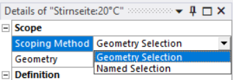

    ??? note "Hinweis zu Named Selection"
        Es gibt weiterhin noch „Named Selection" — dabei wird eine Geometrie
        über einen Namen definiert. Dies ist z.B. für Parameterstudien mit
        veränderlicher Geometrie wichtig.

2. Klick auf das Feld **Geometry** im Detailfenster
    - **Fall a)** Geometrie war **bereits ausgewählt** und kann nun
      verändert werden:

        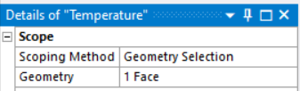

        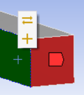

        - bereits vorher ausgewählte Geometrie ist rot markiert
        - durch Klick auf eine andere Geometrie (grün markiert) kann diese
          getauscht oder hinzugefügt werden

    - **Fall b)** Geometrie war **noch nicht ausgewählt**:

        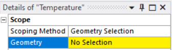

    - **Geometrieauswahl:**
        - **Geometrietyp** über das Auswahltool wählen
        - **Mehrfachauswahl** mit STRG vor der Auswahl
        - **Verschieben:** mittlere Maustaste gedrückt halten + STRG
        - **Drehen:** mittlere Maustaste gedrückt halten

    - Mit Klick auf **Apply** die Auswahl bestätigen

        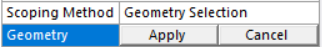

## Die Randbedingungen im Einzelnen

### Temperatur

- Temperatur kann konstant oder (zeitlich/örtlich) variabel definiert werden

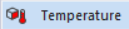

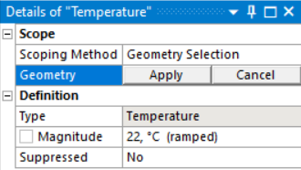

??? note "Detaillierte Beschreibung (Geometrien / Abstraktionen / Einstellungen / Parameter)"
    **Geometrien / Elemente:**

    ✔ Body (Körper) · ✔ Face (Fläche) · ✔ Edge (Kante) · ✔ Vertex (Punkt)
    ✔ Element · ✔ Element Face · ✔ Nodes (Knoten)

    **Abstraktionen:**

    ✔ 3D · ✔ 2D (eben) · ✔ 2D (Rotationssymmetrie)

    **Einstellungen:** keine

    **Parameter:**

    1. **Temperatur** — Einstellung über den Pfeil im Wertefeld ▶
        - **konstant**: Eingabe über das Wertefeld
        - **Tabular** (zeit- oder ortsabhängig): Eingabe über Tabular Data
            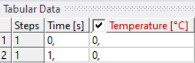
        - **Function** (zeit- oder ortsabhängig): Eingabe über das Wertefeld
          (örtliche Variablen: x, y, z; zeitliche Variable: time)

### Konvektion (Convection)

- **Konvektion** wird über die **Wärmestromdichte** berechnet:

$$
\tag{1}\widehat{\dot{q}}=\alpha (t_s - t_f)
$$

- Eingabe des **Wärmeübergangskoeffizienten** (Film Coefficient) und der
  **Temperatur des Fluids** (Ambient Temperature)

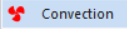

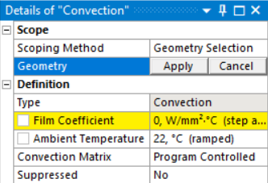

??? note "Formelzeichen (zu Gleichung 1)"
    $$
    \widehat{\dot{q}}\to\mathrm{Wärmestromdichte} \\ \alpha\to\mathrm{Wärmeübergangskoeffizient\,(Film\,Coefficient)} \\ t_s\to\mathrm{Temperatur\,an\,der\,Fläche} \\ t_f\to\mathrm{Temperatur\,des\,Fluids}
    $$

??? note "Detaillierte Beschreibung (Geometrien / Abstraktionen / Einstellungen / Parameter)"
    **Geometrien / Elemente:**

    ✔ Body (Körper, nur 3D) · ✔ Face (Fläche) · ✔ Edge (Kante, nur 3D) ·
    ❌ Vertex (Punkt)
    ❌ Element · ✔ Element Face · ❌ Nodes

    **Abstraktionen:**

    ✔ 3D · ✔ 2D (eben) · ✔ 2D (Rotationssymmetrie)

    **Einstellungen:**

    1. Convection Matrix: **Program Controlled** (automatisch) /
       **Diagonal** / **Consistent**

    **Parameter:**

    1. **Film Coefficient** (Wärmeübergangskoeffizient):
       konstant / Tabular / Function (x, y, z, time)
        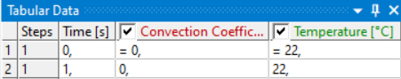
    2. **Ambient Temperature** (Temperatur des Fluids):
       konstant / Tabular / Function (x, y, z, time)

### Wärmestrahlung (Radiation)

- Die Beschaffenheit der **Strahleroberflächen** (**3D: Fläche**,
  **2D: Kante**) wird durch den **Emissionsgrad** beschrieben. Er gibt an,
  wie viel Strahlung im Vergleich zum idealen Wärmestrahler abgegeben wird
  (maximal gleich 1).
- Das Stefan-Boltzmann-Gesetz ergibt eine nichtlineare Abhängigkeit der
  Strahlung von der Temperatur
- Angabe der **Umgebungstemperatur** (Ambient Temperature)
- Definiert über **Strahlung zur Umgebung** (To Ambient) oder von
  **Körper zu Körper** (Surface to Surface)

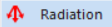

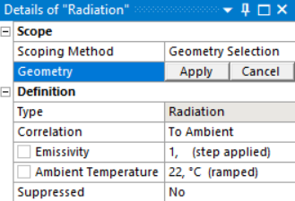

??? note "Detaillierte Beschreibung (Geometrien / Abstraktionen / Einstellungen / Parameter)"
    **Geometrien / Elemente:**

    ❌ Body · ✔ Face (Fläche, nur 3D) · ✔ Edge (Kante, nur 2D) · ❌ Vertex
    ❌ Element · ✔ Element Face · ❌ Nodes

    **Abstraktionen:**

    ✔ 3D · ✔ 2D (eben) · ✔ 2D (Rotationssymmetrie)

    **Einstellungen:**

    1. Correlation
        - Correlation = **To Ambient**: Strahlung zur Umgebung
        - Correlation = **Surface to Surface**: Strahlung zwischen
          Oberflächen
            - **Enclosure**: Zahl, um Flächen zuzuordnen, die Strahlung
              untereinander austauschen. Flächen, die zueinander strahlen,
              sollten die gleiche Zahl erhalten.
            - **Enclosure Type = Open**: zwischen definierten Flächen und
              der Umgebung
            - **Enclosure Type = Perfect**: nur zwischen definierten Flächen

    **Parameter:**

    1. **Emissivity** (Emissionsgrad): konstant
    2. **Ambient Temperature**: konstant / Tabular (zeitabhängig, nur für
       Correlation=To Ambient) / Function (time)

!!! info "Mehr zur Strahlung"
    Die Strahlung von **Körper zu Körper** (Surface to Surface) wird im
    [Beispiel Cerankochfeld](Beispiel-Cerankochfeld.md) vertieft.

### Wärmestrom (Heat Flow + Perfectly Insulated)

- Das Vorzeichen gibt die Richtung an:
    - **Wärmeaufnahme**: positiv
    - **Wärmeabgabe**: negativ
- **Perfectly Insulated** → Wärmestrom = 0
- Werden mehrere Flächen/Kanten ausgewählt, wird der Wärmestrom auf diese
  aufgeteilt

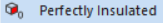

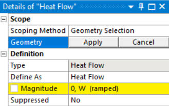

??? note "Detaillierte Beschreibung (Geometrien / Abstraktionen / Einstellungen / Parameter)"
    **Geometrien / Elemente:**

    ❌ Body · ✔ Face (Fläche, nur 3D) · ✔ Edge (Kante; Hinweis bei 2D: nicht
    wenn Kanten geteilt/geshared sind) · ✔ Vertex (Punkt)
    ❌ Element · ✔ Element Face · ❌ Nodes

    **Abstraktionen:**

    ✔ 3D · ✔ 2D (eben) · ✔ 2D (Rotationssymmetrie)

    **Einstellungen:**

    1. Define As
        - **Heat Flow** (Standard): normaler Wärmestrom
        - **Perfectly Insulated**: Wärmestrom = 0

    **Parameter:**

    1. **Magnitude** (Wärmestrom): konstant / Tabular (zeitabhängig, nur
       Flächen 3D und Kanten 2D) / Function (time, nur Flächen 3D und
       Kanten 2D)

### Wärmestromdichte (Heat Flux)

- Das Vorzeichen gibt die Richtung an:
    - **Wärmeaufnahme**: positiv
    - **Wärmeabgabe**: negativ

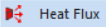

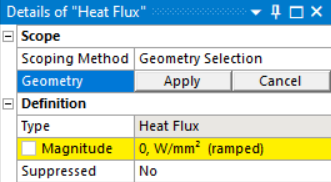

??? note "Detaillierte Beschreibung (Geometrien / Abstraktionen / Einstellungen / Parameter)"
    **Geometrien / Elemente:**

    ✔ Body (Körper, nur 3D) · ✔ Face (Fläche) · ✔ Edge (Kante, nur 2D) ·
    ❌ Vertex
    ❌ Element · ✔ Element Face · ❌ Nodes

    **Abstraktionen:**

    ✔ 3D · ✔ 2D (eben) · ✔ 2D (Rotationssymmetrie)

    **Einstellungen:** keine

    **Parameter:**

    1. **Magnitude** (Wärmestromdichte): konstant / Tabular (zeitabhängig) /
       Function (time)

### Wärmeerzeugung (Internal Heat Generation)

- Wärmeerzeugung in einem **Körper** fungiert entweder als
    - **Wärmequelle**: positiv
    - **Wärmesenke**: negativ

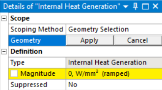

??? note "Detaillierte Beschreibung (Geometrien / Abstraktionen / Einstellungen / Parameter)"
    **Geometrien / Elemente:**

    ✔ Body (Körper) · ❌ Face · ❌ Edge · ❌ Vertex
    ✔ Element · ❌ Element Face · ❌ Nodes

    **Abstraktionen:**

    ✔ 3D · ✔ 2D (eben) · ✔ 2D (Rotationssymmetrie)

    **Einstellungen:** keine

    **Parameter:**

    1. **Magnitude** (Wärmestrom/Volumen): konstant / Tabular
       (zeitabhängig) / Function (time)

### Sonderfall: Imported Temperature (Temperatur aus anderer Analyse)

- Über das **Workbench-Projektmenü** können **Lösungen** (Temperaturen) von
  **anderen Analysen** (bei gleicher Geometrie) übertragen und **als Last**
  (Temperatur) in die **neue Analyse** übernommen werden.
- Für jeden Lastschritt wird die Temperaturlast aus „**Imported
  Temperature**" und der normalen „**Temperature**" auf die Geometrie
  angebracht, wobei die „**Imported Temperature**" Vorrang hat.

**Ablauf:**

1. **Drag & Drop** von Solution (Analyse mit Lösung) auf Setup (Analyse mit
   Randbedingung)
2. **Öffnen** der Analyse (mit Randbedingung) in **Mechanical**
3. **Rechtsklick** auf **Imported Load** (im Strukturbaum unter Steady-State
   Thermal) → **Insert** → **Temperature**
4. **Auswahl** der **Geometrie** über das Detailfenster „Imported
   Temperature" → **Geometry**
5. **Rechtsklick** auf **Imported Temperature → Import Load**

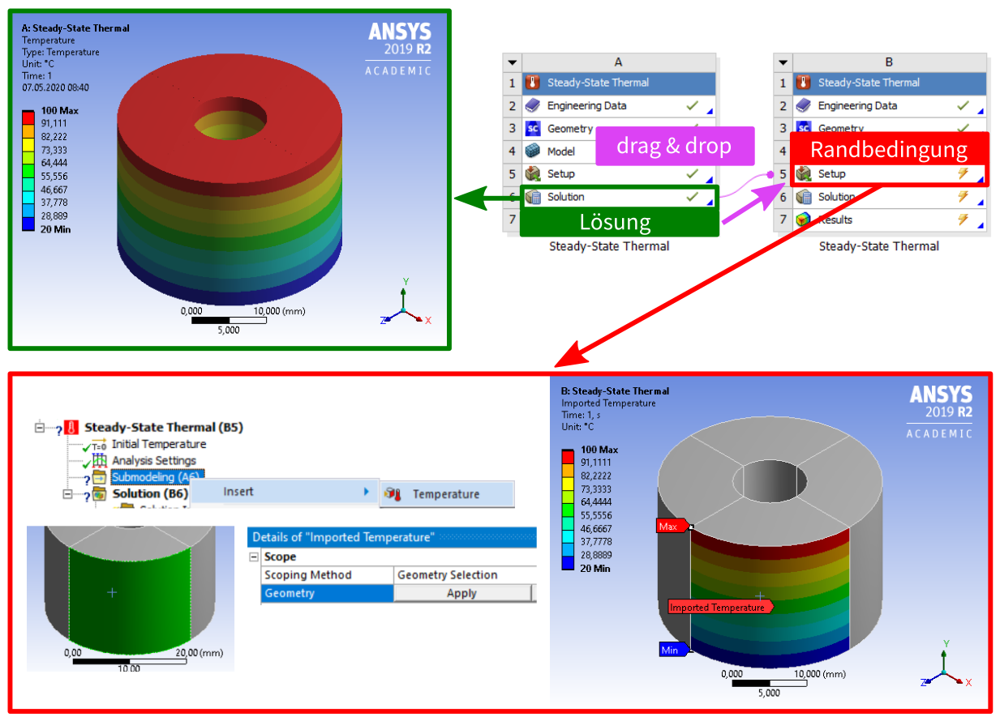

Diese Art der Übertragung kann verwendet werden für:

- **Verbindung verschiedener Analysen**, z.B. zwischen stationärer
  (Steady-State) und transienter Analyse
- **Submodelling**: Hierbei wird die Lösung eines großen Modells (meist
  gröber vernetzt) verwendet, um einen kleinen Bereich in einem neuen Modell
  (Submodell) mit feinerer Vernetzung lokal zu betrachten
