# Beispielaufgabe: Ebene Wand

Im folgenden Beispiel wird eine **transiente Temperaturfeldberechnung**
durchgeführt und mit einer **stationären Rechnung** verglichen. Dabei soll
der **Aufheizvorgang** einer **ebenen Wand durch Sonneneinstrahlung**
abstrahiert werden.

Neben dem Vergleich zur stationären Lösung wird auf die zwei verschiedenen
Konzepte zur Vorgabe der Starttemperatur eingegangen:

- Im einfachen Fall wird die Temperatur konstant über das gesamte Bauteil
  angenommen (Aufgabe a).
- Im erweiterten Fall (Aufgabe b), der eher der Realität entspricht, wird
  die Temperaturverteilung aus einer stationären Berechnung als
  Anfangsbedingung verwendet.
- Im letzten Fall (Aufgabe c) werden zusätzlich die Randbedingungen über die
  Zeit variiert.

Um Rechenzeit zu sparen, wird das Modell in 2D abstrahiert.

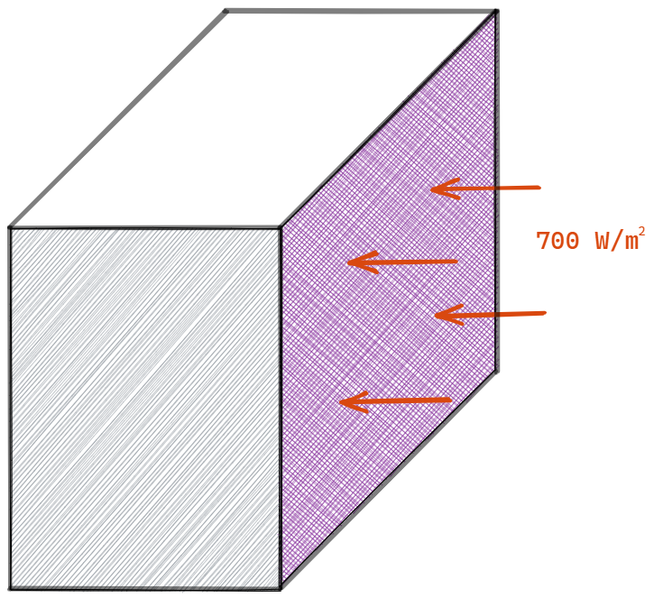

## Aufgabenstellung

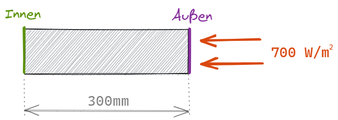

!!! info
    Die folgenden Tutorials wurden im **Einheitensystem Metric**
    (kg, **m**, s, **°C**, A, N, V) erstellt.

!!! question "Aufgabe"
    Eine „Transient Thermal"-Analyse in ANSYS Workbench hinzufügen und unter
    Berücksichtigung der gegebenen Geometrie, Materialien und
    Randbedingungen ein Finite-Elemente-Modell erstellen. Um Rechenzeit zu
    sparen, wird empfohlen, die Wand in 2D zu **abstrahieren**.

    Den **Temperaturverlauf** und den Verlauf der **Wärmestromdichte** über
    die Wanddicke für die Zeitpunkte 10 min, 30 min, 60 min, 120 min,
    240 min für die Fälle a)–c) bestimmen.

    Den **Fall a)** mit **zwei verschiedenen Zeitschrittweiten** simulieren
    und die Ergebnisse gegenüberstellen.

    Für die **Fälle a) und b)** auch eine **stationäre Lösung** ermitteln
    und die Ergebnisse diskutieren.

**a)** **Initialtemperatur**: konstant | **Randbedingungen**:
zeit**un**abhängig — Über Nacht ist die Wand homogen auf 20 °C abgekühlt
und wird mit 700 W/m² aufgeheizt. *(Variation: transient mit zwei
Zeitschritten, stationär)*

**b)** **Initialtemperatur**: aus stationärem Zustand | **Randbedingungen**:
zeit**un**abhängig — Über Nacht hat sich für die Wand ein stationärer
Zustand zwischen innen (20 °C) und außen (12 °C) eingestellt. Die
Außentemperatur beträgt konstant 12 °C. Die Wand wird mit 700 W/m²
aufgeheizt. *(Variation: transient, stationär)*

**c)** **Initialtemperatur**: aus stationärem Zustand | **Randbedingungen**:
zeit**ab**hängig — Mit demselben Ausgangszustand wie b) steigt die Wärmelast
kontinuierlich alle 30 min um 100 W/m² auf den maximalen Wert von 700 W/m².
Im gleichen Intervall steigt die Außentemperatur linear um 1 K. *(nur
transient)*

## Gegeben

**Maße:**

- Wanddicke: 0,3 m
- Wandhöhe: beliebig (in der Beispielgeometrie 0,05 m)

!!! tip
    Da die Höhe hier keine Rolle spielt, wird empfohlen, diese so gering wie
    möglich zu wählen. Das verringert die Rechenzeit; eine zu kleine Höhe
    führt in der Praxis jedoch zu anderen Schwierigkeiten (z.B. bei der
    Auswahl der Kanten der Innen- bzw. Außenwand).

**Material:** Beton

- Spezifische Wärmekapazität (*Specific Heat*):
  $c_p=780 \,\mathrm{\frac{J}{kg\,K}}$
- Dichte (*Density*): $\rho=2300 \,\mathrm{\frac{kg}{m^3}}$
- isotrope Wärmeleitfähigkeit (*Isotropic Thermal Conductivity*):
  $\lambda=0{,}72 \,\mathrm{\frac{W}{K\,m}}$

## Randbedingungen

??? note "Randbedingungen für a)"
    **Anfangstemperatur:** $T_{initial}=20\,\mathrm{°C}$

    **Außenfläche:**

    - Konvektion: $\alpha =30 \,\mathrm{\frac{W}{m^2\,K}}$, $T_{amb}=20\,\mathrm{°C}$
    - Wärmezufuhr: $\widehat{\dot{q}}=700 \,\mathrm{\frac{W}{m^2}}$

    **Innenfläche:**

    - Konvektion: $\alpha =8 \,\mathrm{\frac{W}{m^2\,K}}$, $T_{amb}=20\,\mathrm{°C}$

??? note "Randbedingungen für b)"
    **Anfangstemperatur:**

    $$
    T_{initial}(x)=20\,\mathrm{°C}-26{,}\bar{6}\,\mathrm{\frac{K}{m}}\,x
    \qquad 0\,\mathrm{m}\leq x\leq0{,}3\,\mathrm{m}
    $$

    (gemeint ist ein Temperaturgradient von 20 °C bis 12 °C von der Innen-
    zur Außenwand)

    **Außenfläche:**

    - Konvektion: $\alpha =30 \,\mathrm{\frac{W}{m^2\,K}}$, $T_{amb}=12\,\mathrm{°C}$
    - Wärmezufuhr (analog a): $\widehat{\dot{q}}=700 \,\mathrm{\frac{W}{m^2}}$

    **Innenfläche:**

    - Konvektion (analog a): $\alpha =8 \,\mathrm{\frac{W}{m^2\,K}}$, $T_{amb}=20\,\mathrm{°C}$

??? note "Randbedingungen für c)"
    **Anfangstemperatur (analog b):**

    $$
    T_{initial}(x)=20\,\mathrm{°C}-26{,}\bar{6}\,\mathrm{\frac{K}{m}}\,x
    \qquad 0\,\mathrm{m}\leq x\leq0{,}3\,\mathrm{m}
    $$

    **Außenfläche:**

    - Konvektion:
      $\alpha =30 \,\mathrm{\frac{W}{m^2\,K}}$,
      $T_{amb}(t)=12\,\mathrm{°C}+\frac{1\,\mathrm{K}}{1800\,\mathrm{s}}\,t$
      für $0\,\mathrm{s}\leq t\leq14400\,\mathrm{s}$
    - Wärmezufuhr:
      $\widehat{\dot{q}}(t_1)=100 \,\mathrm{\frac{W}{m^2}}+\frac{100\,\mathrm{W}}{1800\,\mathrm{s\,m^2}}\,t_1$
      für $0\,\mathrm{s}\leq t_1\leq10800\,\mathrm{s}$, danach
      $\widehat{\dot{q}}=700 \,\mathrm{\frac{W}{m^2}}$ bis
      $14400\,\mathrm{s}$

    **Innenfläche:**

    - Konvektion (analog a): $\alpha =8 \,\mathrm{\frac{W}{m^2\,K}}$, $T_{amb}=20\,\mathrm{°C}$

## Aufgabe a) Initialtemperatur konstant, Randbedingungen zeitunabhängig

- **ANSYS Workbench** öffnen und das **Projekt speichern**
- Eine neue **Transient-Thermal-Analyse** hinzufügen und umbenennen

**1. Materialdefinition (Workbench)**

- Das gegebene Material mit den jeweiligen Materialparametern hinzufügen

    [KLICK-TUTORIAL: Material selbst definieren (aus Praktikum 1)](http://ior.ad/6XCq){target=_blank}

??? success "Lösung"
    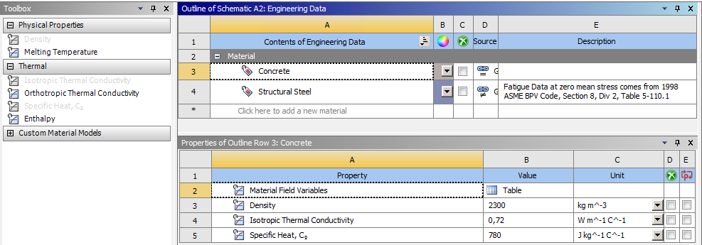

**2. Geometrieerstellung (SpaceClaim)**

- Die notwendige Geometrie erstellen

!!! tip
    Die Einstellungen für die 2D-Abstraktion beachten — siehe
    [Vorzeigeaufgabe Rohr, Aufgabe c](../P2_Modellierung_Vernetzung/Vorzeigeaufgabe-Rohr.md#aufgabe-c-mit-abstraktion-rotationssymmetrie-2d)
    bzw. [KLICK-TUTORIAL: 2D-Einstellungen](http://ior.ad/6Z4P){target=_blank}

??? success "So sollte das Modell aussehen"
    Es ist nur eine 2D-Fläche mit der Dicke d=0,3 m zu modellieren.
    **Hinweis:** Die Höhe der Fläche ist für die Lösung irrelevant und kann
    frei gewählt werden.

    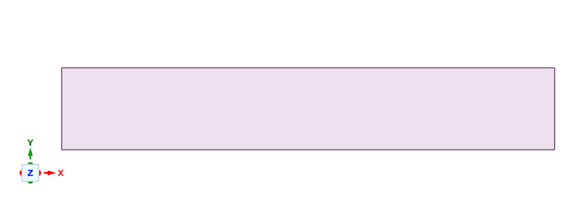

    [:material-download: einschichtige_Wand.scdoc](files/einschichtige_Wand.scdoc)

**3. Materialzuweisung (Mechanical)**

- Der Geometrie das erstellte Material zuweisen

    [KLICK-TUTORIAL: Material zuweisen (aus Praktikum 1)](http://ior.ad/6Xg7){target=_blank}

??? success "So sollte die Materialzuweisung aussehen"
    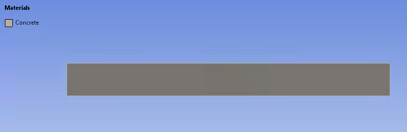

**4. Vernetzung (Mechanical)**

- Das Modell zuerst mit dem automatisch eingestellten Netz vernetzen

??? tip "Hinweise zur Vernetzung"
    Mit `Sizing` und `Type` = `Number of Divisions` oder `Type` =
    `Element Size` kann die Einteilung bzw. die Elementgröße an den Kanten
    vorgegeben werden. **Zusätzlich muss `Behavior` = `Hard` gestellt und
    ein `Face Meshing` für die Fläche eingefügt werden.**

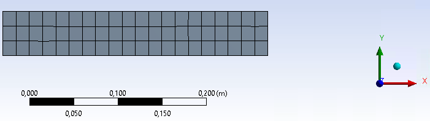

**5. Randbedingungen (Mechanical)**

- Geeignete Randbedingungen wählen (siehe Aufgabenstellung)

So sollten die **Randbedingungen** aussehen:

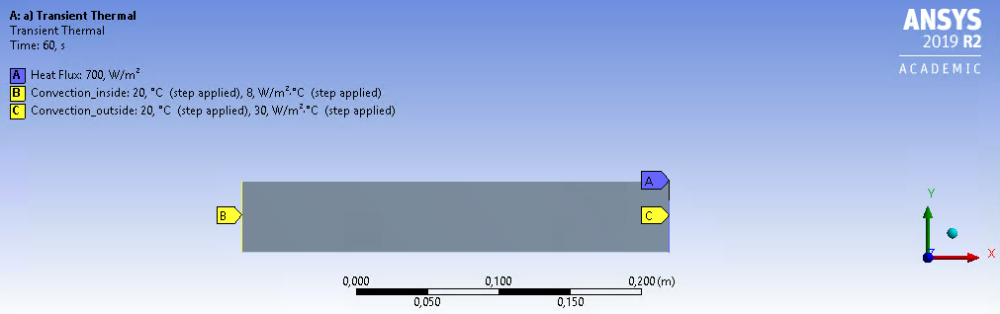

**6. Lösungseinstellungen (Mechanical)**

- Unter **Initial Temperature** die Startbedingung eingeben

    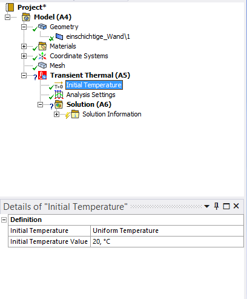

- Unter **Analysis Settings** zunächst die Simulationszeit von 60 s
  eingeben. Automatisch werden die maximalen und minimalen Time Steps sowie
  die Größe des Initial Time Steps vorgegeben.

    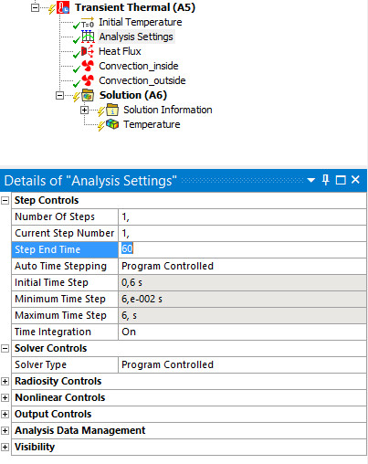

- Das Modell lösen

**7. Lösungsdarstellung (Mechanical)**

- Darstellung eines Zeitpunktes

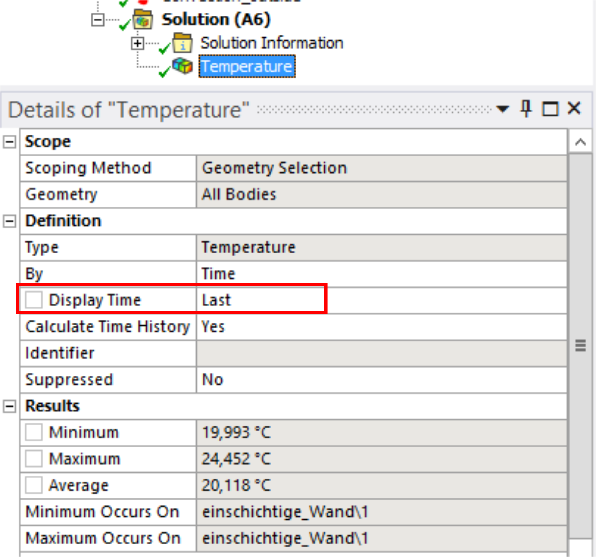

### Thermal Undershoot

Die Temperatur von 20 °C wird unterschritten, obwohl dies durch keinen
Kühlvorgang begründet ist:

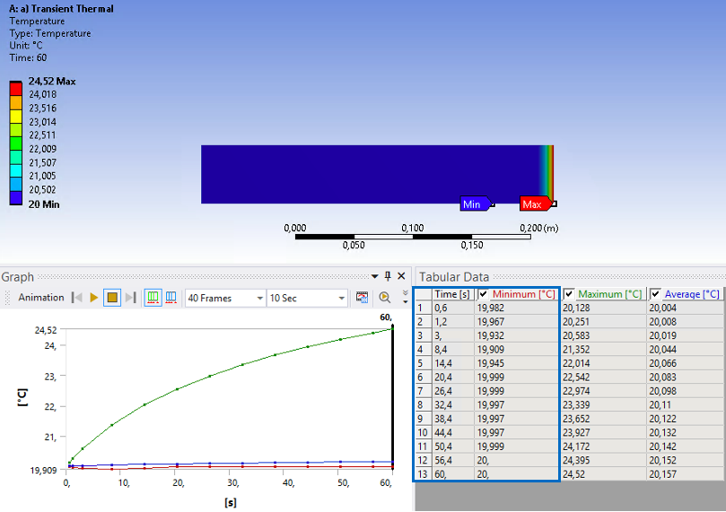

Dieses Ergebnis ist darauf zurückzuführen, dass die gegenseitige
Abhängigkeit der größten Elementgröße und der minimalen Zeitschrittweite
nicht beachtet wurde (siehe [Einleitung](Einleitung.md)).

Mit

$$
a=\frac{\lambda}{\rho\,c_p}=\frac{0{,}72}{780\cdot2300} \,\mathrm{\frac{m^2}{s}}=4{,}01\cdot 10^{-7} \,\mathrm{\frac{m^2}{s}}
$$

ergibt sich die minimale Zeitschrittweite bei dem **gegebenen Netz mit 20
Elementen** in Richtung des größten Wärmestroms (über die Wanddicke d):

$$
\Delta t=\frac{(\Delta x)^2}{4\, a}=\frac{(\frac{0{,}3\,\mathrm{m}}{20})^2}{4\cdot4{,}01\cdot10^{-7}\,\mathrm{\frac{m^2}{s}}}\approx140\,\mathrm{s}
$$

  
<strong>Frage:</strong> Wie groß ist der minimale Zeitschritt Δt (in s) für das Netz mit 20 Elementen über die Wanddicke?

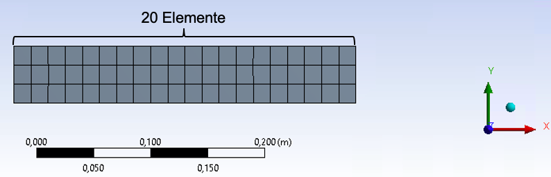

In den Analyseeinstellungen ist zu erkennen, dass die **minimale
Zeitschrittweite für dieses Netz viel zu klein** gewählt wurde. Nun kann
entweder die Elementgröße im relevanten Bereich angepasst werden und/oder
die minimale Zeitschrittweite.

Die Berechnung wird schrittweise durchgeführt: Das thermische Verhalten des
Modells in einem Zeitintervall wird jeweils aufbauend auf dem vorher
berechneten Schritt gelöst. Die Genauigkeit der Ergebnisse steigt mit mehr
Zeitschritten bzw. der Verringerung der Zeitschrittweiten. Um die minimale
Zeitschrittweite zu senken, muss das Netz in x-Richtung verfeinert werden.

**4'. Vernetzung (Mechanical)**

- Es werden **zwei Zeitschritte vorgegeben**, die ein **Vielfaches der
  Endzeit** sind:
    - i) $\Delta t = 15\,\mathrm{s}$
    - j) $\Delta t = 5\,\mathrm{s}$

Mit Hilfe von Gleichung (4) aus der [Einleitung](Einleitung.md) kann die
**maximale Elementgröße** ${\Delta x_{max}}$ berechnet werden:

$$
\mathrm{i)}\;\, {\Delta x_{max}}=\sqrt{\Delta t\cdot4a} =\sqrt{15\,\mathrm{s}\cdot4\cdot4{,}01\cdot10^{-7}\,\mathrm{\tfrac{m^2}{s}}} = 4{,}91\cdot10^{-3}\,\mathrm{m}
$$

$$
\mathrm{j)}\;\, {\Delta x_{max}}=\sqrt{\Delta t\cdot4a} =\sqrt{5\,\mathrm{s}\cdot4\cdot4{,}01\cdot10^{-7}\,\mathrm{\tfrac{m^2}{s}}} = 2{,}83\cdot10^{-3}\,\mathrm{m}
$$

- Da immer ganzzahlige Elemente vorliegen, wird die Einteilung aus der
  Wanddicke durch die berechnete Elementgröße bestimmt:
    - i) $\frac{0{,}3\,\mathrm{m}}{4{,}91\cdot10^{-3}\,\mathrm{m}}\approx61$
      Elemente in Dickenrichtung (für $\Delta t = 15\,\mathrm{s}$)
    - j) $\frac{0{,}3\,\mathrm{m}}{2{,}83\cdot10^{-3}\,\mathrm{m}}\approx106$
      Elemente in Dickenrichtung (für $\Delta t = 5\,\mathrm{s}$)

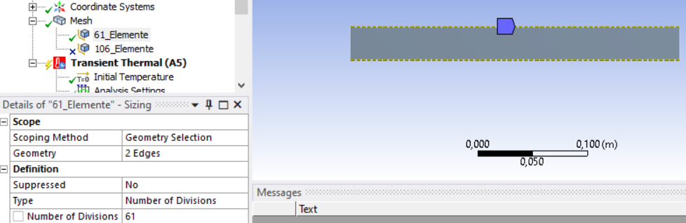

- Die Vernetzung der Kante nur mit **Edge Sizing** führt in **2D** zu einer
  **inhomogenen Vernetzung** — die Elemente in der Mitte werden z.B. größer,
  was durch die Vorgabe der Elementgröße nicht gewollt ist:

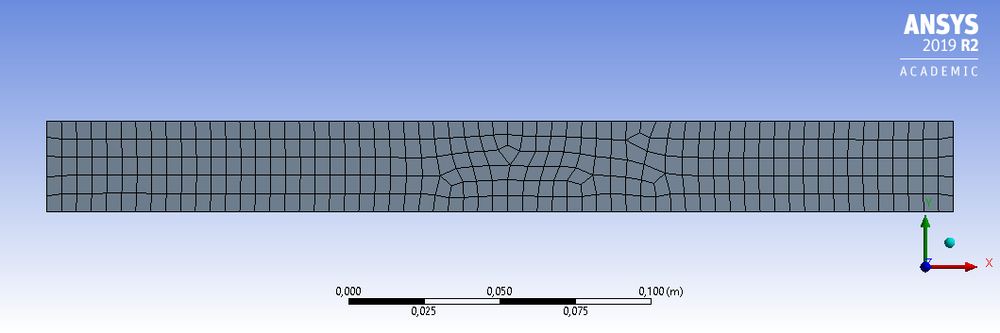

**Lösung 1: Zusätzlich Face Meshing**

- Die Elementgröße in vertikaler Richtung wird dann automatisch gewählt

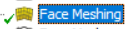

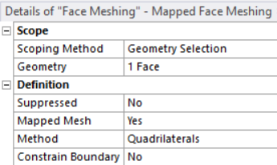

**Lösung 2: Zusätzlich Face Meshing und Edge Sizing auf die vertikalen
Kanten**

- Hier kann die Elementgröße in vertikaler Richtung eingestellt werden
  (z.B. auf Element Divisions = 1)
- Zusätzlich muss bei den vertikalen und horizontalen Edge Sizings unter
  Advanced das **Behavior** auf **Hard** gestellt werden

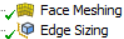

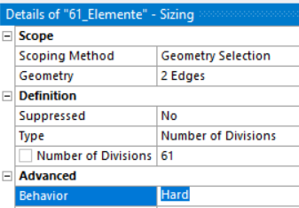

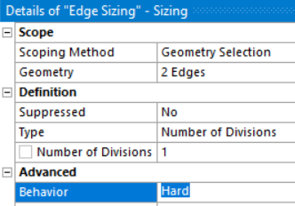

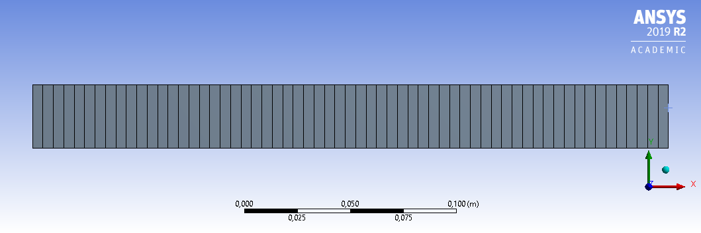

**6'. Lösungseinstellungen (Mechanical)**

- Unter Analysis Settings die Zeitschrittweiten für Variante i) eingeben.
  Um die Ergebnisse in einheitlichen Schrittweiten zu erhalten, für die
  erste, die minimale und die maximale Zeitschrittweite den gleichen Wert
  wählen. Das Modell lösen und die Temperaturlösung für den gesamten Körper
  betrachten. Den Vorgang für Variante j) wiederholen.

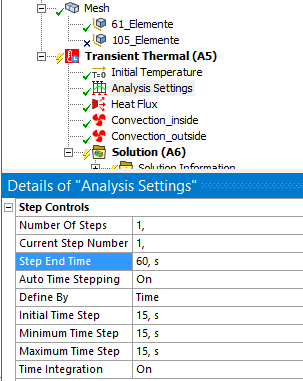

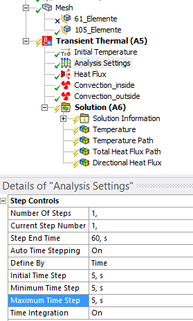

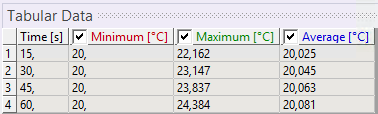

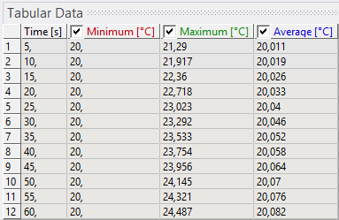

- Die minimale Temperatur von 20 °C wird nicht mehr unterschritten. Die
  Ergebnisse nach Variante j) sind genauer, da die Netzdichte höher und die
  Zeitschritte kleiner sind als bei Variante i).

**6''. Lösungseinstellungen (Mechanical)**

Nun die Simulation mit den Varianten i) und j) durchführen, um Aufgabe a)
zu lösen.

- Die geforderte Rechenzeit einstellen (14400 s)

    ??? success "Lösung für i) Δt=15 s"
        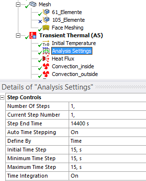

- Um Speicherplatz zu sparen, kann unter **Output Controls** ausgewählt
  werden, in welchen **Intervallen** die **Ergebnisse ausgegeben** werden:

    Output Controls → Store Results At → **Specified Recurrence Rate**;
    **Value** gibt an, aller wie viel Zeitschritte Daten gespeichert werden.

    - Beispiel 1: Δt=5 s, Value=1 → speichert alle 5 s (alle Ergebnisse)
    - Beispiel 2: Δt=5 s, Value=3 → speichert alle 15 s (jeden dritten
      Zeitschritt)
    - Beispiel 3: Δt=5 s, Value=720 → speichert jede Stunde (jeden 720.
      Zeitschritt)

    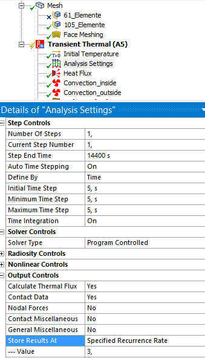

### Result Tracker

Um die Ergebnisse während der Berechnung zu überprüfen, können Temperaturen
(globales Minimum/Maximum) oder Werte auf ausgewählten Geometrien (z.B.
Innen- und Außenwand) angezeigt werden.

Standardmäßig ist der Tracker für das globale Minimum und Maximum
voreingestellt. Er kann durch Auswahl im Strukturbaum unter Solution
Information

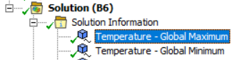

anschließend im Grafikfenster während der Berechnung angezeigt werden:

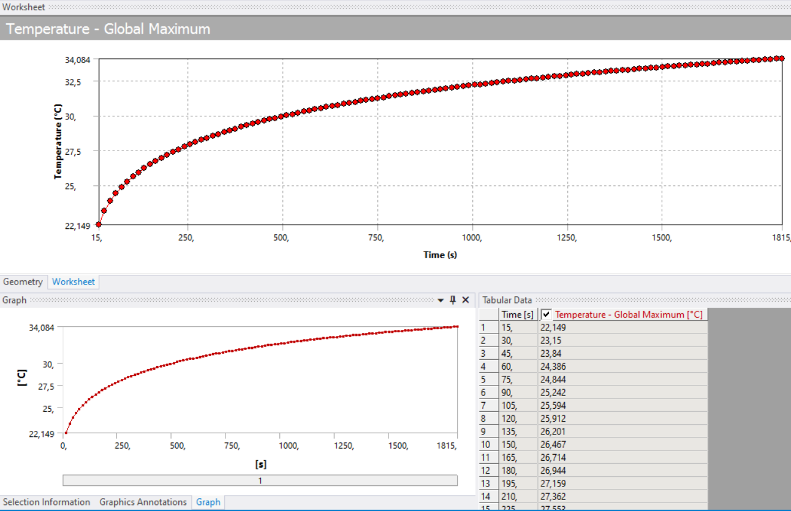

??? tip "Kurzanleitung: Result Tracker an einer bestimmten Stelle definieren"
    1. Im Strukturbaum → Rechtsklick Solution Information → Insert →
       Temperature
        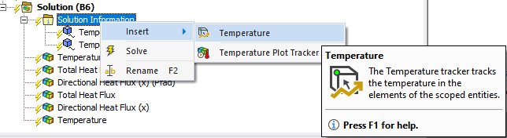
    2. Zur Auswahl können nur **Knoten (Nodes)** selektiert werden. Dazu
       zunächst in den gewünschten Bereich zoomen (z.B. ein Knoten auf einer
       Außenwand) — dafür die Zoom Box wählen
        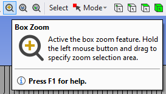
    3. Durch Ziehen der Box in den gewählten Bereich zoomen
        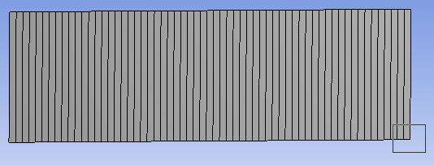
    4. Knotenauswahltool aktivieren
        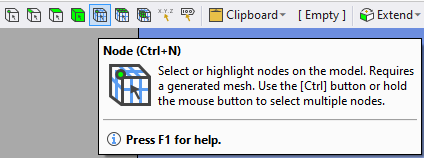
    5. Box-Auswahl aktivieren
        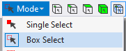
    6. Eine Box über den gewünschten Knoten ziehen
        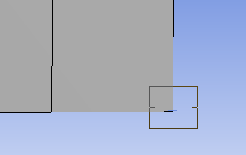
    7. Die grüne Markierung zeigt an, dass ein Knoten ausgewählt wurde
        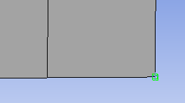
        Zur Kontrolle wird in der Leiste unten angezeigt, dass nur ein
        Knoten ausgewählt ist, samt Position:
        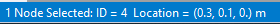
    8. Im Detailfenster des neu angelegten Temperatur-Trackers → Geometry
       anklicken → bestätigen
        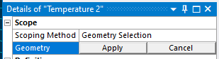
    9. Ggf. die Auswahl wieder auf Single Select stellen
        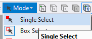
    10. Während der Berechnung kann durch Anklicken des jeweiligen Result
        Trackers die Information im Grafikfenster angezeigt werden
        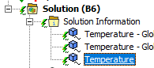
        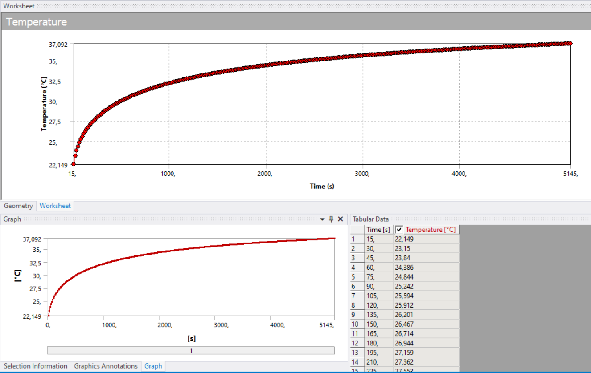

**7'. Lösungsdarstellung (Mechanical)**

??? note "Zusatz: Animation"
    - Frames und Animationszeit einstellen, Export möglich

    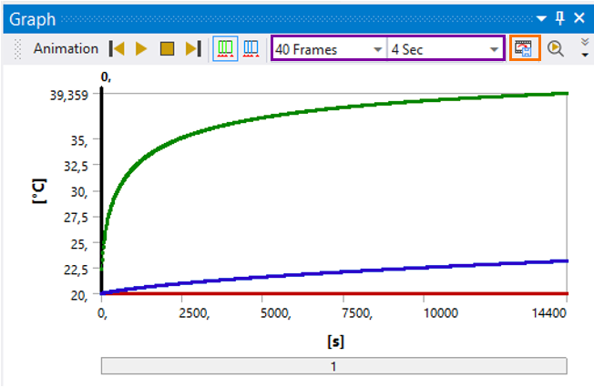

    [:material-download: Beispielanimation.mp4](files/Beispielanimation.mp4)

- Pfaderstellung: einen Pfad über die Wanddicke erstellen

    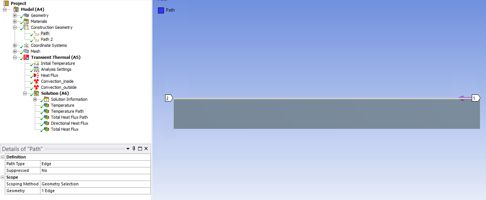

- Eingabe der Zeitpunkte, z.B. für 10 min und 30 min:

    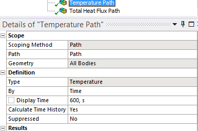

    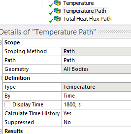

- Die Temperaturverläufe und den Verlauf der Wärmestromdichte über die
  Wanddicke für die Zeitpunkte 10 min, 30 min, 60 min, 120 min und 240 min
  bestimmen

??? success "Lösung transiente Analyse"
    Zur Gegenüberstellung die minimalen, maximalen und durchschnittlichen
    Werte im gesamten Modell:

    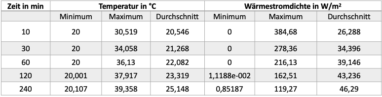

    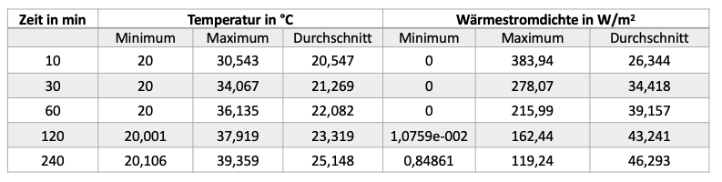

    **Temperatur**

    i) Lösung für $\Delta t=15\,\mathrm{s}$ und **61 Elemente**:

    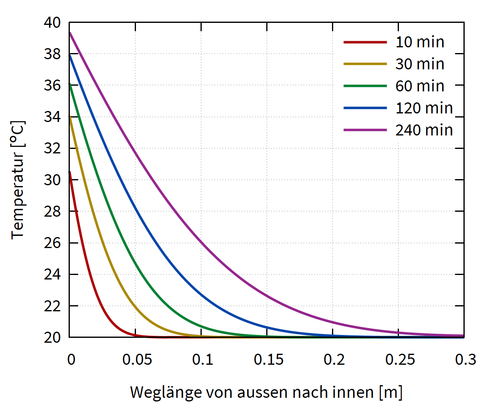

    j) Lösung für $\Delta t=5\,\mathrm{s}$ und **106 Elemente**:

    

    **Wärmestromdichte**

    i) Lösung für $\Delta t=15\,\mathrm{s}$ und **61 Elemente**:

    

    j) Lösung für $\Delta t=5\,\mathrm{s}$ und **106 Elemente**:

    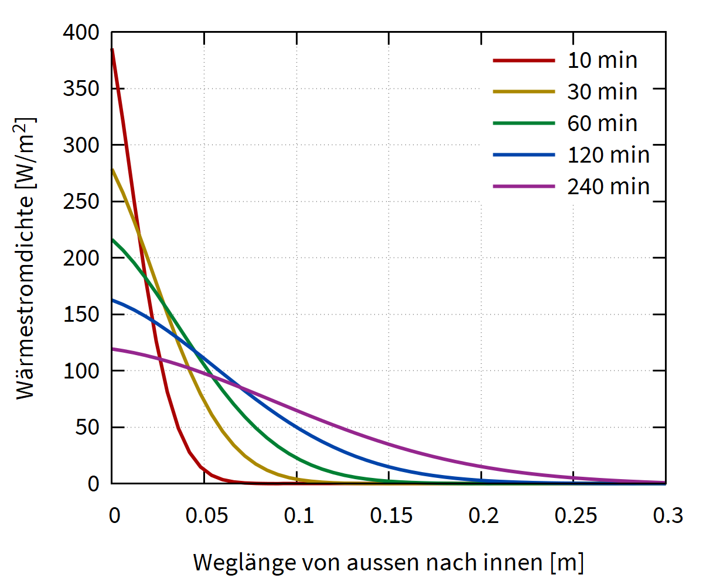

- Den Temperaturverlauf sowie den Verlauf der Wärmestromdichte über die
  Wanddicke für den stationären Fall bestimmen

??? success "Lösung stationäre Analyse"
    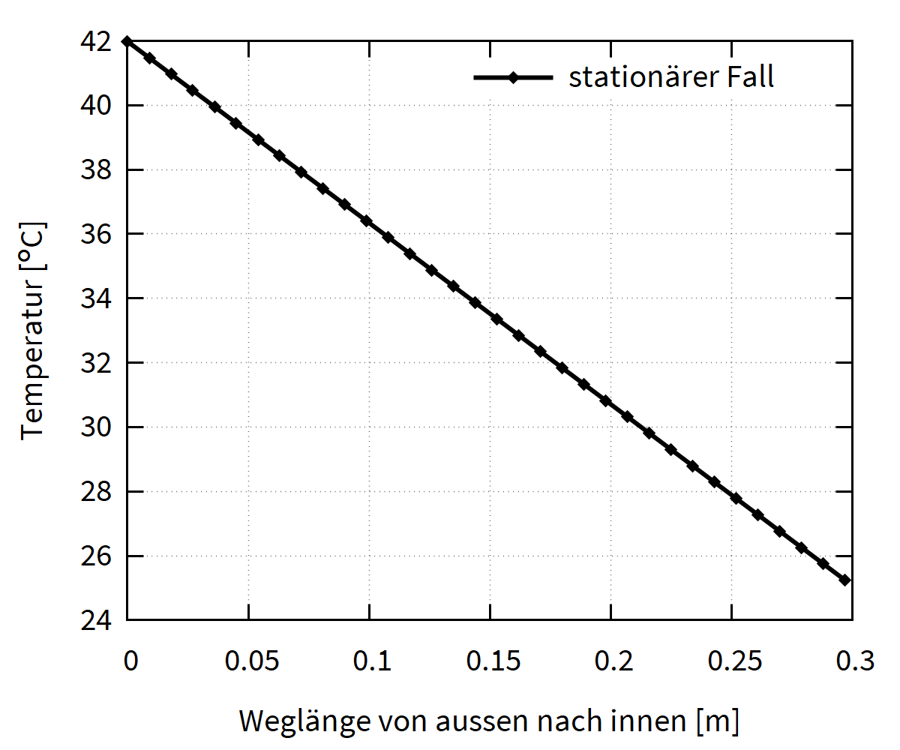

    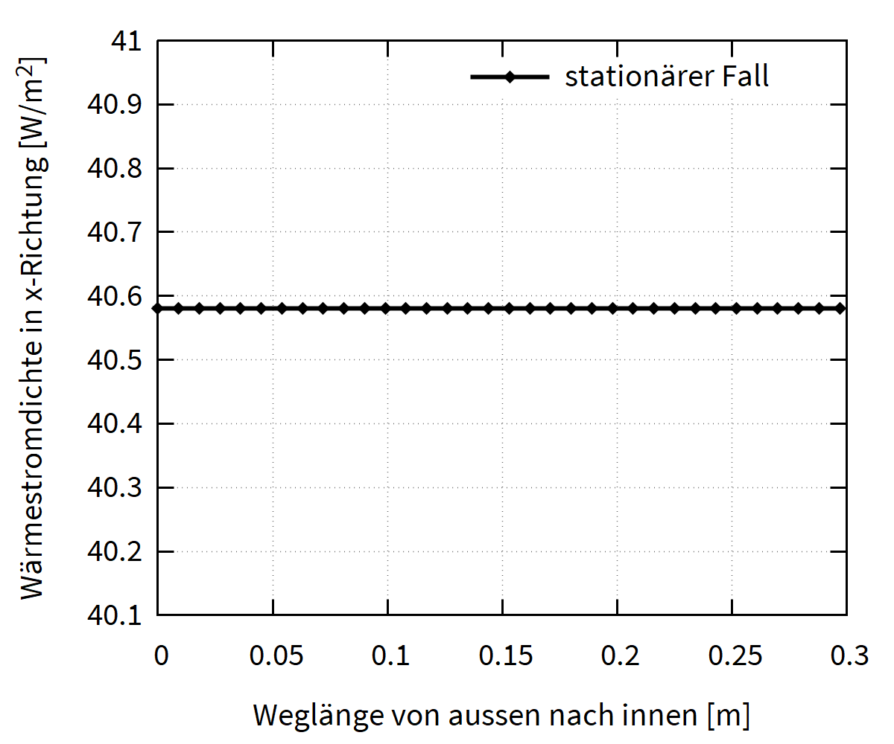

### Diskussion zu a)

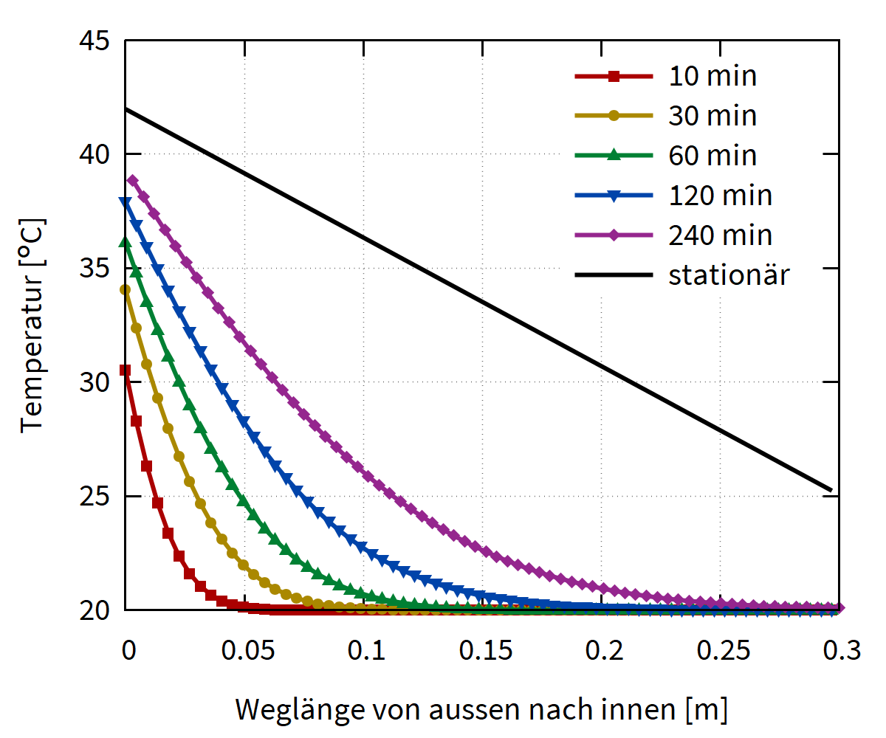

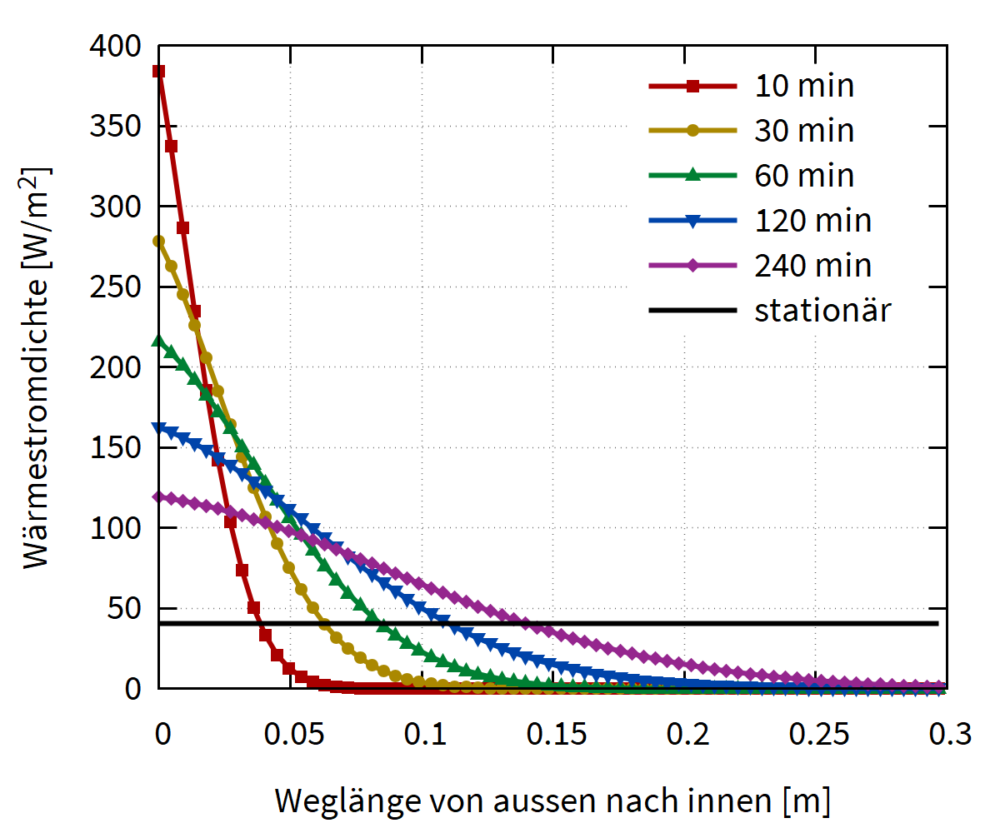

Die Abweichungen der Ergebnisse zwischen der Simulation mit 61 Elementen
über die Wanddicke (Zeitschrittweite 15 s) und der Simulation mit 106
Elementen (5 s) sind im Bereich der ausgewerteten Parameter gering. Die
Simulationszeit ist mit Variante j) deutlich höher. Aus diesen Gründen
werden die Netz- und Analyseeinstellungen für die Aufgaben b) und c)
ausschließlich nach Variante i) vorgenommen.

Bei konstanten Randbedingungen nähert sich die transiente Lösung mit der
Zeit der stationären Lösung an. Bis der Verlauf der transienten Lösung
nahezu dem der stationären entspricht, dauert es mehrere Stunden
(schätzungsweise über 40 h).

## Aufgabe b) Initialtemperatur aus stationärem Zustand, Randbedingungen zeitunabhängig

Zunächst werden die Ausgangsbedingungen (Temperaturverteilung aus dem
stationären Zustand) erzeugt. Diese werden später als Initialtemperaturen in
der transienten Berechnung verwendet.

Zuerst eine „Steady-State Thermal"-Analyse erstellen.

**1. Materialdefinition (Workbench)**

- Die Zelle der aktuellen Analyse mit der von Aufgabe a) verknüpfen

**2. Geometrieerstellung (SpaceClaim)**

- Die Zelle der aktuellen Analyse mit der von Aufgabe a) verknüpfen

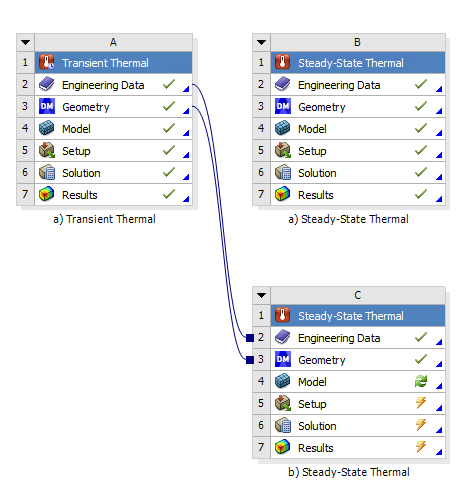

**3. Materialzuweisung (Mechanical)**

- wie in Aufgabe a)

**4. Vernetzung (Mechanical)**

- Das Modell mit 61 Elementen in x-Richtung vernetzen, wie in Aufgabe a)
  Variante i)

**5. Randbedingungen (Mechanical)**

- Die geeigneten Randbedingungen wählen, um als Ergebnis die
  Ausgangssituation für die transiente Analyse zu erhalten

!!! warning
    Dies sind nicht die finalen Randbedingungen aus Aufgabe a)! Es soll
    zunächst ein Temperaturgradient im Ausgangszustand erzeugt werden —
    die Wärmestromdichte auf der Außenwand kommt erst danach hinzu.

??? success "So sollten die Randbedingungen aussehen"
    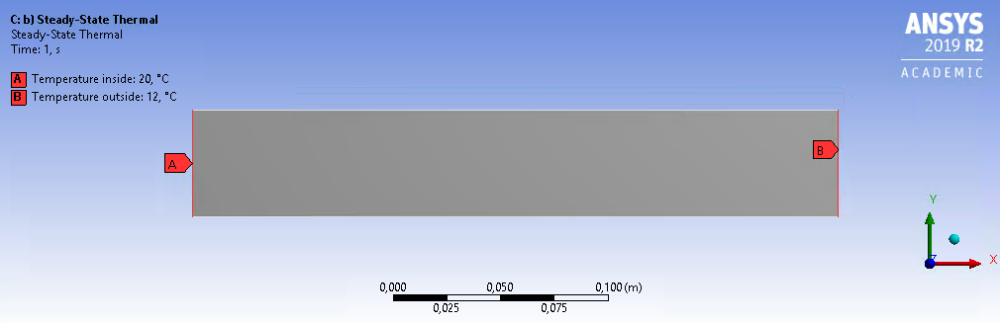

**6. Lösungseinstellungen (Mechanical)**

- keine spezielle Lösungseinstellung erforderlich; Lösen über den
  Solve-Button

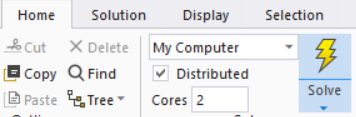

??? success "Lösung stationärer Fall"
    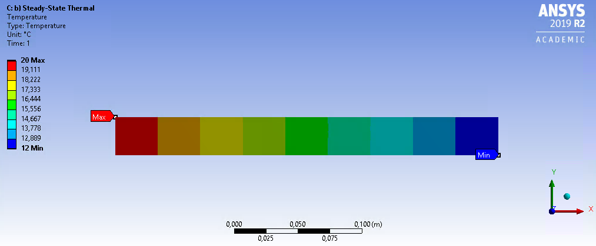

    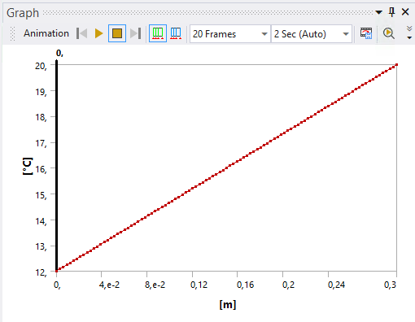

!!! info
    Damit sind die Initialtemperaturen für die transiente Berechnung
    hergestellt. Im Folgenden wird beschrieben, wie diese Temperaturen aus
    der stationären Berechnung in das transiente Modell übertragen werden.

**5*. Randbedingungen (Mechanical)**

- Zurück in die Workbench gehen und mit der rechten Maustaste auf die
  Solution-Zelle des aktuellen Projekts klicken → Transfer Data To New →
  Transient Thermal

    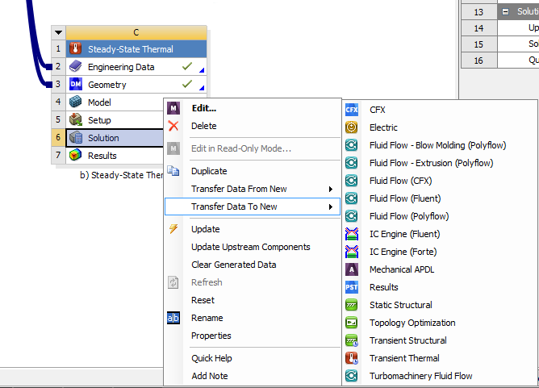

- Das Setup der neuen transienten Analyse öffnen

    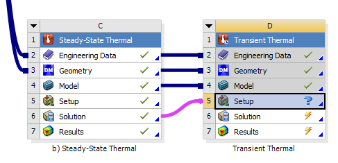

- Die Randbedingungen für Aufgabe b) definieren

??? success "So sollten die Randbedingungen aussehen"
    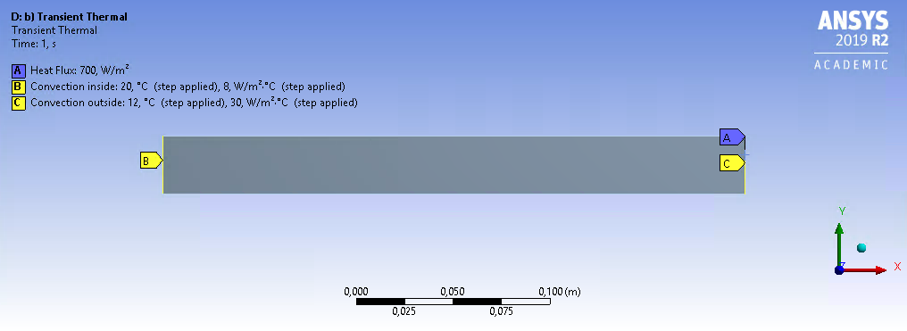

- Als Anfangstemperatur der transienten Analyse werden automatisch die
  Ergebnisse der stationären Analyse festgelegt:

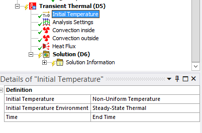

**6*. Lösungseinstellungen (Mechanical)**

- Die Einstellungen für die transiente Analyse analog zur Variante i) aus
  Aufgabe a) vornehmen und das Modell lösen

    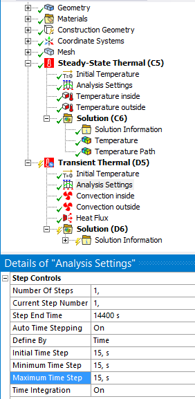

**7. Lösungsdarstellung (Mechanical)**

??? note "Zusatz: Animation"
    [:material-download: Beispielanimationb.mp4](files/Beispielanimationb.mp4)

- Die Temperaturverläufe und den Verlauf der Wärmestromdichte über die
  Wanddicke für die Zeitpunkte 10 min, 30 min, 60 min, 120 min und 240 min
  bestimmen. Für die Aufgaben b) und c) ist die **Richtung** der
  Wärmestromdichte zu berücksichtigen.

??? success "Lösung transiente Analyse"
    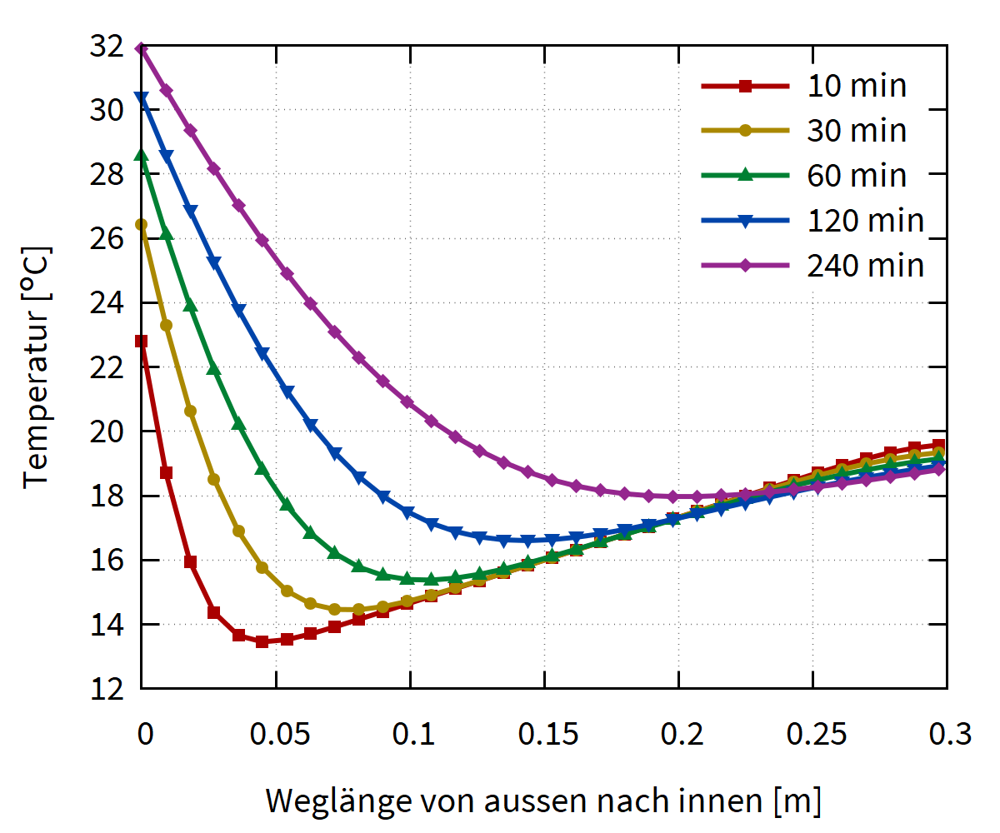

    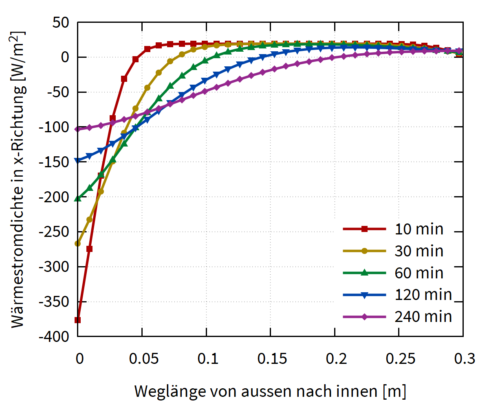

- Den Temperaturverlauf sowie den Verlauf der Wärmestromdichte über die
  Wanddicke für den stationären Fall bestimmen

??? success "Lösung stationäre Analyse"
    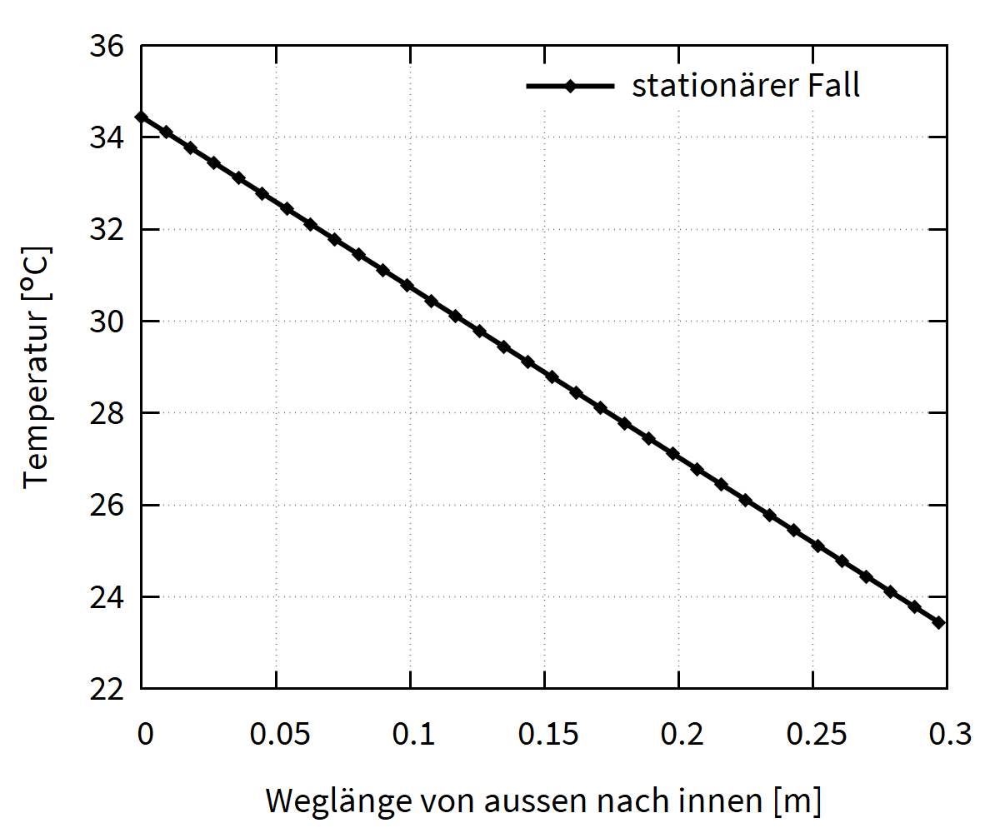

    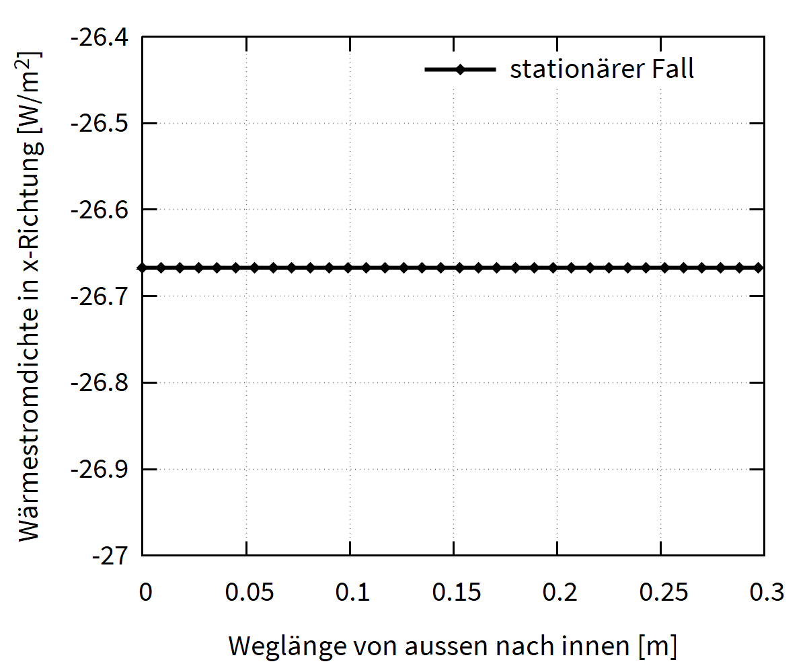

## Aufgabe c) Initialtemperatur aus stationärem Zustand, Randbedingungen zeitabhängig

- Für diese Aufgabe die gleiche Analyse wie in Aufgabe b) verwenden. Die
  Randbedingungen sind nun zeitabhängig. Dafür die Analyseeinstellungen wie
  folgt vornehmen:

    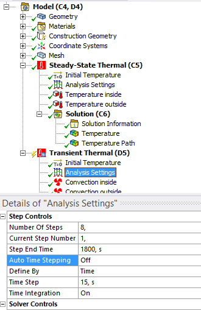

- Es werden 8 Time Steps benötigt, um die zeitabhängigen Randbedingungen zu
  definieren. Die Einstellung der einzelnen Time Steps erfolgt durch Eingabe
  in der Zelle „Current Step Number":

    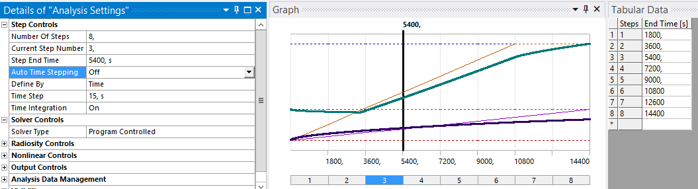

- Ein Time Step hat eine Länge von 30 min bzw. 1800 s. Ein neuer Time Step
  beginnt unmittelbar, wenn der vorherige abgeschlossen ist. Der Endzeitpunkt
  eines Time Steps liegt damit bei der bisher kumulierten Simulationszeit
  plus der aktuellen Time-Step-Länge. Der letzte Time Step endet wie bei den
  Aufgaben a) und b) bei 240 min bzw. 14400 s.
- Die zeitabhängigen Randbedingungen werden bei der jeweiligen Zelle direkt
  in die Tabelle eingegeben:

    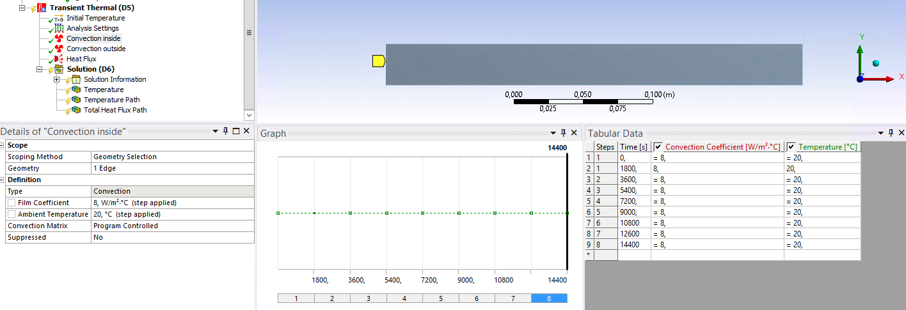

    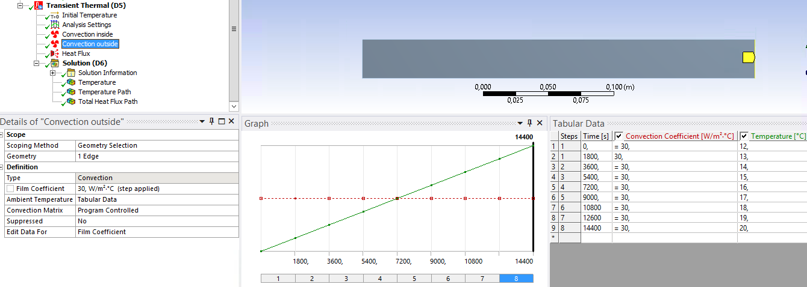

    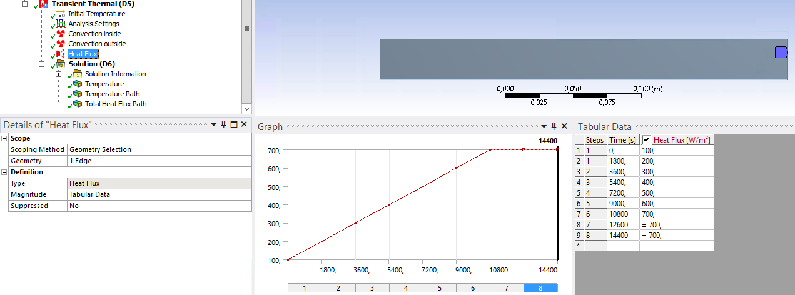

??? note "Hinweis zur Angabe als Funktion"
    Der lineare Verlauf kann auch durch weniger Punkte oder mit Hilfe einer
    Funktion definiert werden. Es sollte der für die Aufgabe effizienteste
    Weg gewählt werden (weitere Infos in der
    [Übersicht Randbedingungen](../P3_Randbedingungen_Postprocessing/Randbedingungen.md)).

    In dieser Aufgabe kann der Verlauf der **Wärmestromdichte nicht über
    eine Funktion abgebildet werden**, weil sie ab 10800 s konstant auf dem
    Wert 700 verläuft und dies mit den gegebenen Funktionen nicht
    darstellbar ist.

    Für die Konvektion auf der Außenseite kann die Außentemperatur jedoch
    über eine Funktion abgebildet werden:

    1. Im Menü zu Ambient Temperature „Function" auswählen
        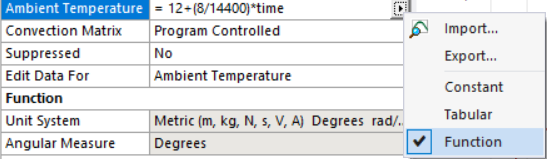
    2. Die Funktion eingeben: `12 + (8/14400) * time`
        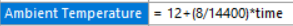
    3. „Edit Data For" auf „Ambient Temperature" stellen → zur Anzeige im
       Graph-Fenster
        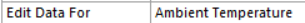
    4. Number of Segments auf 8 stellen
        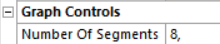

    Final sieht dies dann so aus:

    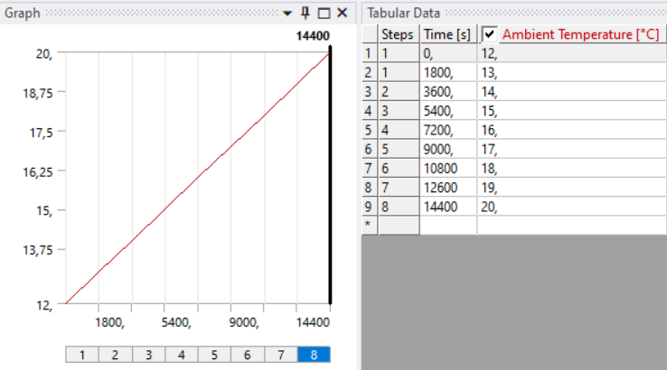

- Das Modell lösen

**7. Lösungsdarstellung (Mechanical)**

??? note "Zusatz: Animation"
    [:material-download: Beispielanimationc.mp4](files/Beispielanimationc.mp4)

- Die Temperaturverläufe und den Verlauf der Wärmestromdichte über die
  Wanddicke für die Zeitpunkte 10 min, 30 min, 60 min, 120 min und 240 min
  bestimmen

??? success "Lösung transiente Analyse"
    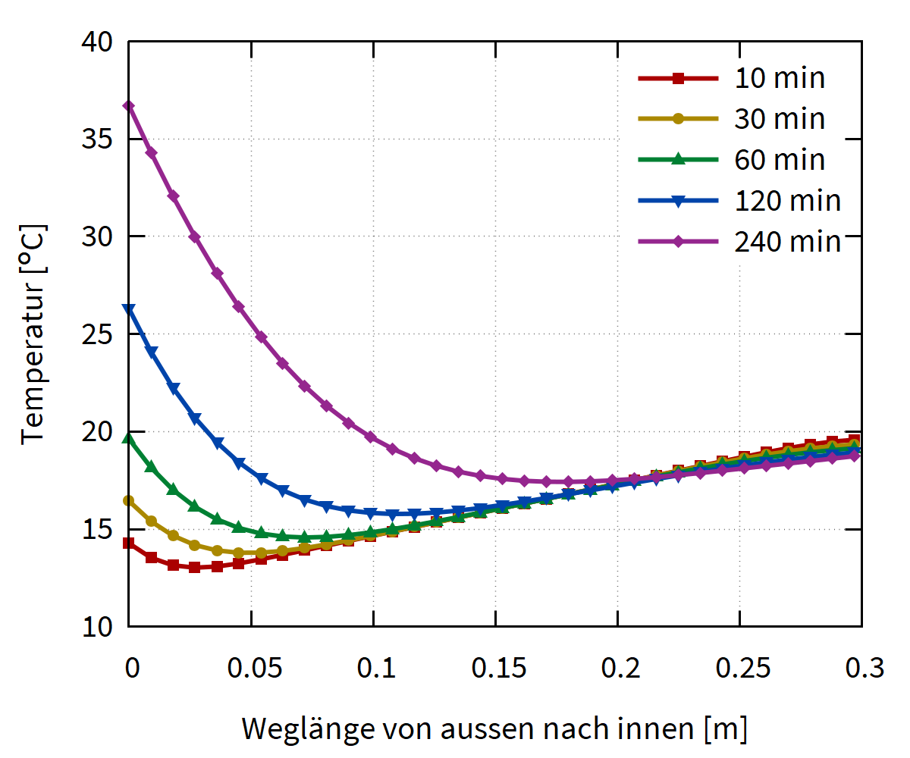

    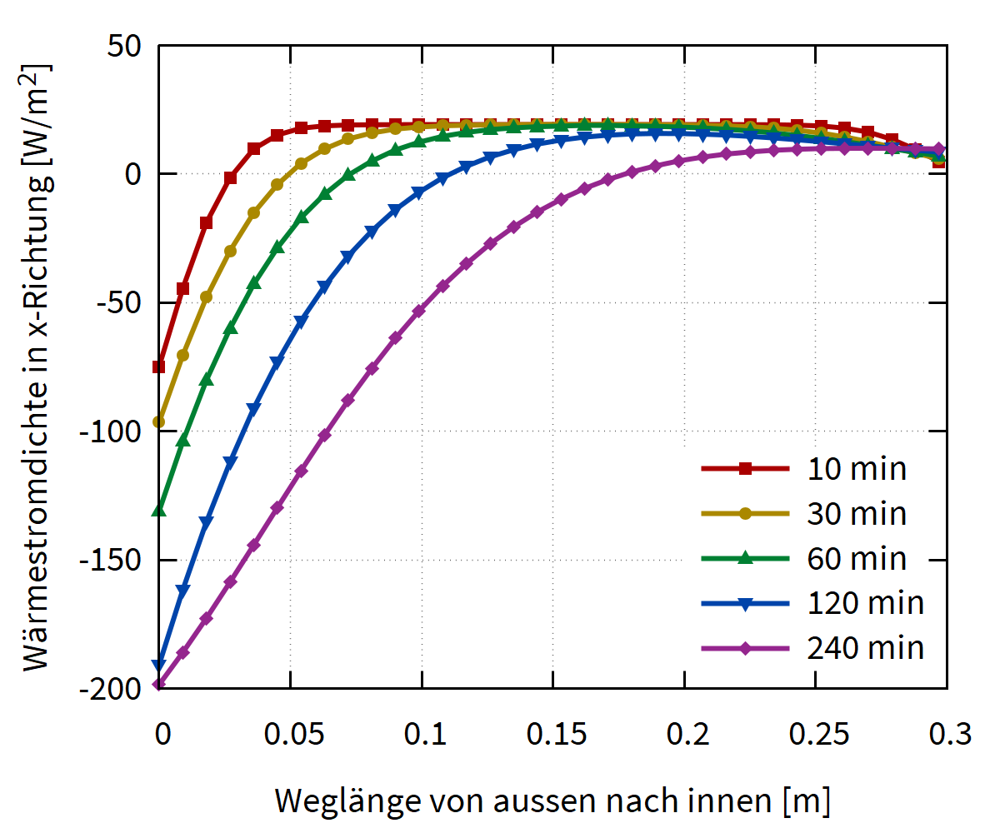

## Diskussion

Bei **Aufgabe a)** strömt der Wärmestrom zu jeder Zeit ausschließlich in
negative x-Richtung, also in Richtung der Innenwandfläche. Genauso gibt es
die stationäre Analyse wieder. Es konnte allerdings festgestellt werden,
dass zur **näherungsweisen Erreichung des stationären Zustandes konstante
Randbedingungen über mehr als einen Tagesverlauf notwendig** sind. Mit der
alleinigen Berücksichtigung einer stationären Analyse könnten falsche
Annahmen zur Temperatur der Innenflächen und somit zur Wärmeabgabe an den
Raum getroffen werden. Zudem hat der **Ausgangszustand für eine transiente
Analyse eine große Bedeutung** und ist nicht leichtfertig auszuwählen.

In **Aufgabe b)** wird berücksichtigt, dass draußen und drinnen
unterschiedliche Temperaturen vorherrschen und die **Wand zum Startzeitpunkt
nicht homogen eine Temperatur** hat. In diesem Fall wird der Innenfläche in
positiver x-Richtung Wärme entzogen; die Temperatur der Innenfläche sinkt um
ca. 1–2 °C unter 20 °C. Dieser Prozess kehrt sich mit der Zeit um, da im
stationären Zustand die Innenwandtemperatur bei 23,3 °C liegt — einem Raum
wird in diesem Zustand über die Wand Wärme zugeführt.

Um die **thermischen Randbedingungen für diesen Aufheizvorgang noch besser
zu modellieren, werden im Fall c) die schrittweise Temperaturerhöhung der
Außenluft sowie die Steigung der Wärmezufuhr durch die Sonneneinstrahlung
zeitabhängig abstrahiert**. Es resultieren zum Teil deutlich
unterschiedliche Ergebnisse im Bereich der Außenwandfläche zwischen b) und
c). Aus dem Temperaturverlauf ist zu entnehmen, dass die Temperatur über die
Wanddicke für c) — außer bei 240 min — immer unterhalb der Ergebnisse von b)
liegt. Für c) ist die **Wärmezufuhr** über 180 min von 100 W/m² stetig auf
700 W/m² **angestiegen**; **anschließend** hatten die **Wärmestromdichten**
von b) und c) über 60 min den **gleichen Wert** (700 W/m²). Insgesamt hat
das Modell in b) am Ende der Simulation also einen höheren Wärmeeintrag
erhalten als in c).

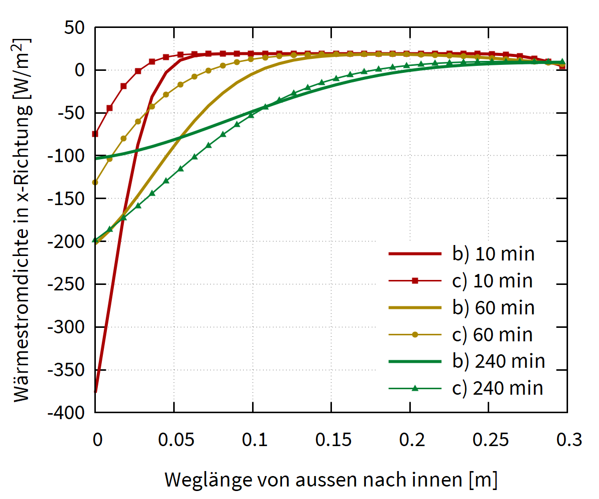

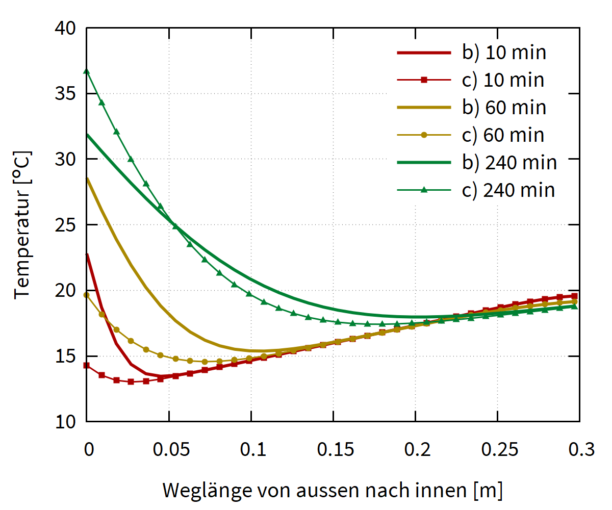

Zusätzlich **steigt** in **c)** die **Umgebungstemperatur** für die
Konvektion außen **über die Zeit** von 12 °C auf 20 °C, während sie in
**b) konstant** bei 12 °C liegt. Das hat einen Einfluss auf die konvektive
Wärmeabgabe der Außenfläche an die Umgebung.

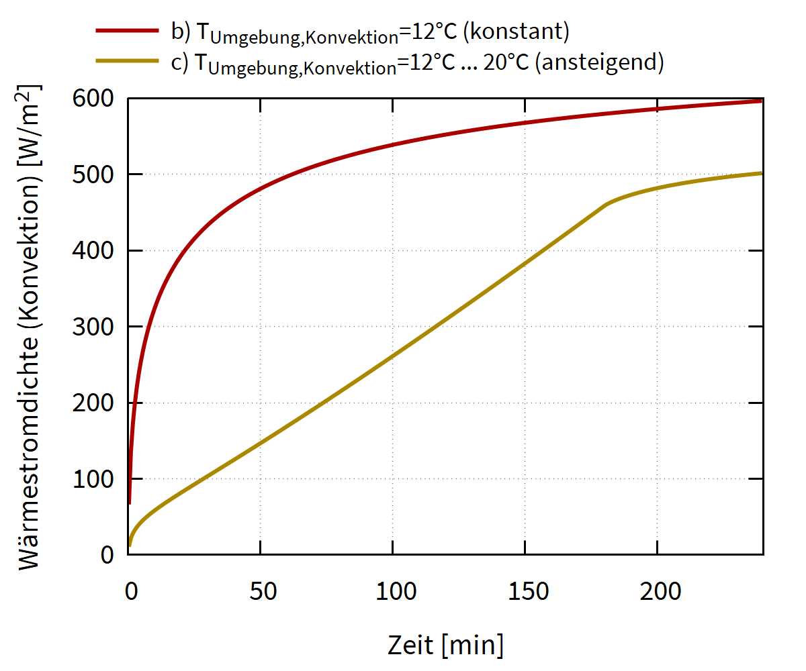

??? note "Hinweis zur Berechnung der Wärmeabgabe durch Konvektion"
    $$
    \widehat{\dot{q}}_{\alpha}=\alpha(\Delta T)=\alpha(T_W-T_{\infty})
    $$

    Mit dem Wärmeübergangskoeffizienten $\alpha=30\,\mathrm{W/m^2K}$ und
    der Außentemperatur für b) $T_\infty=12\,\mathrm{°C}$ bzw. für c)
    $T_{\infty}(t)=12\,\mathrm{°C}+\frac{1\,\mathrm{K}}{1800\,\mathrm{s}}\,t$
    ergibt sich durch Auswertung der Temperatur der Wandaußenfläche die
    Wärmestromdichte durch Konvektion.

In der letzten Abbildung ist zu erkennen, wie groß die **Wärmeabgabe der
Wand an die Umgebung durch Konvektion** für die Fälle b) und c) ist. Die
**gewählten Randbedingungen** führen dazu, dass die **Temperaturdifferenz**
zwischen Wand- und Umgebungstemperatur für den Fall b) zu jedem **Zeitpunkt
höher** ist als für den Fall c). Daraus ergibt sich bei gleichem
Wärmeübergangskoeffizienten für b) eine höhere Wärmeabgabe durch Konvektion.
Die konvektiven Auswirkungen sind nicht zu unterschätzen, da der Wert auf
500–600 W/m² gegenüber der Wärmezufuhr von 700 W/m² ansteigt. Aus diesem
Grund ist die Temperatur der Außenfläche für den Fall c) nach einiger Zeit
höher als für den Fall b). Die zeitabhängigen Differenzen der
Randbedingungen im betrachteten Zeitintervall haben keinen signifikanten
Einfluss auf die thermischen Ergebnisse der Innenwandfläche.
