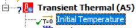
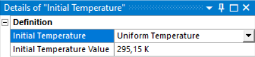
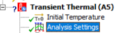
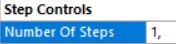
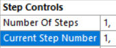
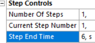
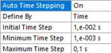
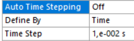

# Einleitung

Bisher wurden nur Temperaturfeldberechnungen im **stationären Zustand
(Steady-State Thermal)** durchgeführt. Im nun folgenden Praktikum wird
**zeitabhängig (transient)** gerechnet. Somit wird nicht nur eine Berechnung
durchgeführt, sondern für jeden Zeitschritt eine eigene Rechnung. Hier macht
sich eine **ressourceneffiziente Vernetzung** und **Abstrahierung** (z.B.
mit 2D) besonders bemerkbar.

Im Gegensatz zur bisher durchgeführten stationären Analyse gibt es ein paar
Besonderheiten. Vor allem die **Wahl des Zeitschritts in Abhängigkeit der
Vernetzung** ist wichtig, da es sonst zu numerischen Ungenauigkeiten kommen
kann.

## Veränderungen gegenüber der stationären Rechnung

**0. Analyse hinzufügen (Workbench)**

- Statt „Steady-State Thermal" wird nun die „**Transient Thermal**"-Analyse
  im Workbench-Projektmenü hinzugefügt

    

**1. Materialdefinition (Workbench)**

- Berücksichtigung des **Einflusses von Wärmespeicherung** durch
  **Verwendung der Materialparameter** **spezifische Wärmekapazität** und
  **Dichte**

!!! info "Temperaturabhängige Materialparameter"
    Weiterhin **können** die Materialparameter auch **temperaturabhängig**
    definiert werden. Dabei wird dann eine **nichtlineare Analyse**
    durchgeführt, da eine iterative Berechnung notwendig ist.

    In diesem Praktikum werden nur lineare Berechnungen mit
    temperatur**un**abhängigen Materialparametern durchgeführt; auf die
    nichtlineare Berechnung wird nicht eingegangen.

**2. Geometrieerstellung (SpaceClaim)**

- keine Änderungen gegenüber „Steady-State Thermal" notwendig

**3. Materialzuweisung (Mechanical)**

- keine Änderungen gegenüber „Steady-State Thermal" notwendig

**4. Vernetzung (Mechanical)**

- Die Elementgröße spielt für die transiente Berechnung eine besondere
  Rolle, da sich der Zeitschritt aus dieser berechnet. Somit ist hier ggf.
  eine genauere Definition der Vernetzung notwendig.

**5. Randbedingungen (Mechanical)**

- Wenn gewünscht, können Randbedingungen **zeitabhängig** definiert werden.
  Mehr Informationen dazu in der
  [Übersicht Randbedingungen aus dem dritten Praktikum](../P3_Randbedingungen_Postprocessing/Randbedingungen.md).

**6. Lösungseinstellungen (Mechanical)**

- Einstellung der Initialbedingungen (Anfangstemperatur) auf konstant oder
  nicht konstant

    ??? note "Details: Initial Temperature"
        

        

        **Anfangstemperatur** — welche Temperatur soll für den
        Startzeitpunkt angenommen werden?

        - **Variante 1 — Uniform Temperature**: ganzes Bauteil auf
          konstanter Temperatur → Beispielaufgabe a)
        - **Variante 2 — Non-Uniform Temperature**: variable Temperatur
          (aus vorhergehender Berechnung) → Beispielaufgabe b)

- Einstellung des Zeitschritts und der Endzeit

    ??? note "Details: Analysis Settings"
        **Hinweis**: Auch im stationären Fall kann mit verschiedenen
        Lastschritten gerechnet werden, z.B. wenn sich Randbedingungen je
        nach Schritt ändern sollen.

        

        **Number of Steps** (Anzahl der Lastschritte)
        Sobald z.B. eine Randbedingung nach einem Schritt geändert werden
        soll, muss dies hier eingestellt werden.

        

        **Current Step Number** (aktuelle Schrittnummer)
        Hier die Nummer des Schrittes eingeben, für den die Eigenschaft
        geändert werden soll.

        

        **Step End Time** (Endzeit für den aktuellen Schritt)

        

        **Auto Time Stepping** (automatische Zeitschrittweiteneinstellung)

        - **Auto Time Stepping = On**:
          Angabe eines initialen, minimalen und maximalen Zeitschritts —
          ANSYS wählt den Zeitschritt automatisch in dem freigegebenen
          Fenster

            

        - **Auto Time Stepping = Off**:
          Angabe des Zeitschritts für die Berechnung

            

        - **Output Controls**: in welchen Zeitschritten soll die Lösung
          gespeichert werden
        - **Result Tracker**: Ausgabe von Ergebnissen an definierten Orten
          zur Kontrolle während der Berechnung

**7. Lösungsdarstellung (Mechanical)**

- Darstellung der Ergebnisse für einen speziellen Zeitpunkt oder als
  Animation über die Zeit

## Einstellung des Zeitschritts in Abhängigkeit der Vernetzung

Für die transiente Berechnung ist neben der Zeitdauer vor allem die Wahl des
**Zeitschritts** $\Delta t$ von besonderer Bedeutung, weil dieser bei
falscher Einstellung zu numerischen Fehlern führen kann.

Anders als man intuitiv vermuten würde, gibt es für den Zeitschritt eine
**untere Grenze**, die nicht unterschritten werden darf. Sie berechnet sich
aus der Elementlänge $\Delta x$ (in Richtung des Wärmeflusses) und der
Temperaturleitfähigkeit des Materials $a$:

$$
\tag{1}\Delta t_{min}= \frac{({\Delta x}_{max})^2}{4a}
$$

??? note "Formelzeichen"
    $$
    \Delta t_{min}\to\mathrm{minimaler \,Zeitschritt} \\ \Delta x_{max} \to\mathrm{maximale\,Elementlänge\,in\,Wärmeflussrichtung} \\ a \to\mathrm{Temperaturleitfähigkeit}
    $$

!!! info "Temperaturleitfähigkeit"
    Die Temperaturleitfähigkeit $a$ eines Materials ist das Verhältnis aus
    der Fähigkeit, Energie durch Wärmeleitung zu transportieren, relativ zur
    Fähigkeit, sie zu speichern. Materialien mit einer hohen
    Temperaturleitfähigkeit passen sich Änderungen schneller an als solche
    mit niedrigem Wert, die den stationären Zustand erst später erreichen.

Die Temperaturleitfähigkeit $a$ berechnet sich aus:

$$
\tag{2}a= \frac{\lambda}{\rho\,c_p}
$$

??? note "Formelzeichen"
    $$
    \rho\to\mathrm{Dichte} \\ \lambda\to\mathrm{Wärmeleitfähigkeit} \\ c_p\to\mathrm{spezifische\,Wärmekapazität}
    $$

Durch Einsetzen von Gleichung (2) in (1) erhält man:

$$
\tag{3}\Delta t_{min}= \frac{({\Delta x_{max}})^2\,\rho\,c_p}{4\lambda}
$$

Somit kann mit Gleichung (1) bzw. (3) entweder der **minimale Zeitschritt**
$\Delta t_{min}$ oder die **maximale Elementgröße** $\Delta x_{max}$
bestimmt werden.

Durch Umstellen von Gleichung (1) nach der **Elementgröße** kann bei
Vorgabe des Zeitschritts auch die **maximale Elementgröße** $\Delta x_{max}$
berechnet werden:

$$
\tag{4}{\Delta x_{max}}=\sqrt{\Delta t_{min}\,4a}
$$

Durch Einsetzen der Temperaturleitfähigkeit $a$ aus Gleichung (2) in (4)
erhält man:

$$
\tag{5}{\Delta x_{max}}=\sqrt{\frac{4\Delta t_{min}\,\lambda}{\rho\,c_p}}
$$

!!! success "Merke"
    Der **Zeitschritt darf nicht kleiner** als $\Delta t_{min}$ bzw. die
    **Elementgröße** (in Wärmeflussrichtung) **nicht größer** als
    $\Delta x_{max}$ gewählt werden.
