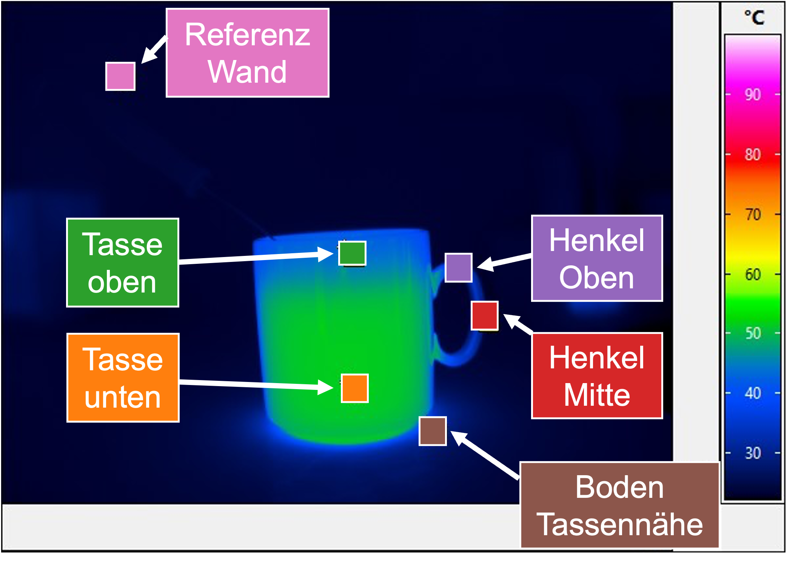
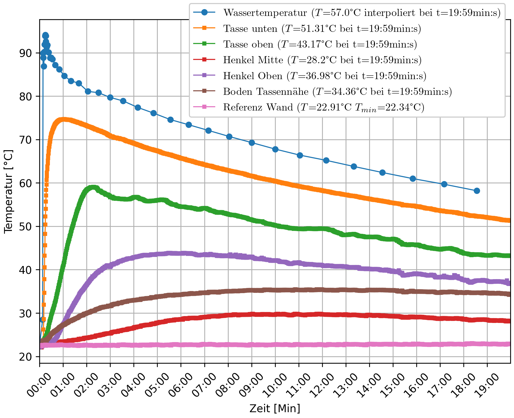
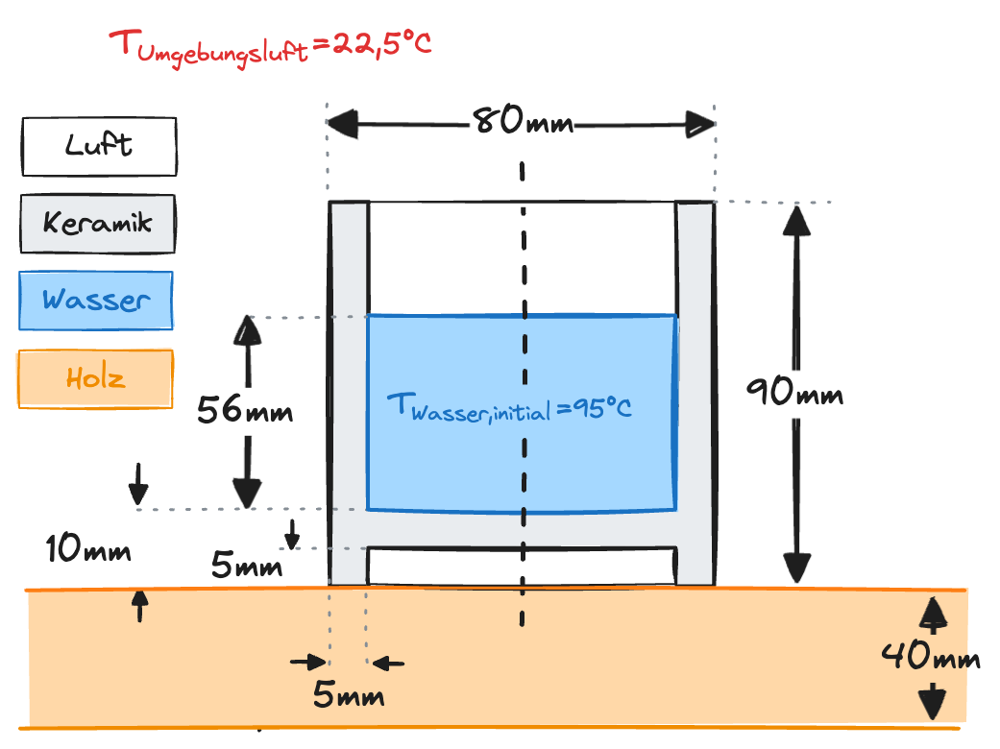

# Zusatzaufgabe: Abkühlung Teewasser

Wie in der ersten Veranstaltung angekündigt, besteht nun die Möglichkeit,
die Simulation zur Abkühlung der Teetasse selbst durchzuführen.

## Aufgabenstellung

Alle für die Aufgabe notwendigen Daten (Geometrie / Material /
Starttemperaturen) sind im folgenden Bild zusammengefasst:

!!! question "Aufgabe"
    Selbstständig ein Simulationsmodell erstellen, das den Abkühlvorgang der
    Teetasse abstrahiert, und dies mit den unten gegebenen Messdaten
    abgleichen.

## Messdaten (Rohdaten)

Gemessen mit der Wärmebildkamera (alle 5 Sekunden) bzw. mit dem
Temperaturfühler im Wasser:

- [:material-download: Temperaturen_Waermebildkamera.xlsx](files/Temperaturen_Waermebildkamera.xlsx)
  — Spalten: Tasse unten/oben, Henkel Mitte/oben, Boden Tassennähe,
  Referenz Wand
- [:material-download: Temperaturen_Wasser.xlsx](files/Temperaturen_Wasser.xlsx)
  — Wassertemperatur am Boden

## Beispiel für eine Simulationsauswertung

Hier beispielhaft der Abgleich einer Simulation. Es zeigt sich noch eine
größere Abweichung zwischen Simulation und Experiment, weil das generelle
Kühlverhalten in der Simulation nicht so schnell verläuft wie im Experiment.

!!! info
    Zur Auswertung wurde hier [Datawrapper](https://www.datawrapper.de/)
    verwendet. Die Daten können genauso gut in Excel oder mit anderen Tools
    visualisiert werden — direkt in ANSYS ist dies leider nicht möglich.

[Interaktives Diagramm: Abgleich Simulation ↔ Experiment](https://datawrapper.dwcdn.net/hJIQo/1/){target=_blank}
