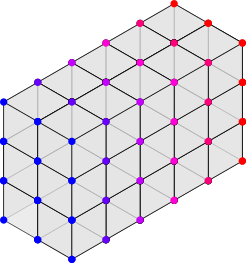
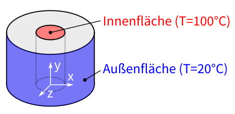
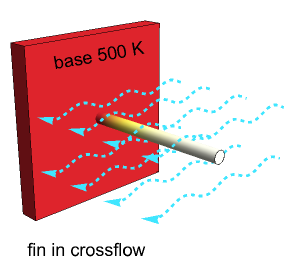

# Angewandte FEM in der Thermodynamik

Temperaturfelder mit der Finite-Elemente-Methode berechnen — von der
stationären Wärmeleitung bis zur transienten Analyse und Strahlung,
Schritt für Schritt in ANSYS Workbench.

<section class="fem-scrolly" id="fem-scrolly" data-phase="0" markdown>
  

    <svg id="fem-svg" role="img" aria-label="Animation: Ein Stab wird vernetzt, thermisch belastet und das Temperaturfeld berechnet"></svg>
    
<strong>1 · Geometrie</strong>Das Bauteil wird als CAD-Geometrie beschrieben.

  

</section>

-   <a class="card-link" href="P1_Einfuehrung/">
        __Praktikum 1 :material-rocket-launch: Einführung in ANSYS Workbench__{ .xxxl .middle .center }
        <figure style="text-align:center;">
          
        </figure>
    </a>

-   <a class="card-link" href="P2_Modellierung_Vernetzung/">
        __Praktikum 2 :material-video-2d: Modellierung & Vernetzung__{ .xxxl .middle .center }
        <figure style="text-align:center;">
          
        </figure>
    </a>

-   <a class="card-link" href="P3_Randbedingungen_Postprocessing/">
        __Praktikum 3 :material-thermometer: Randbedingungen & Postprocessing__{ .xxxl .middle .center }
        <figure style="text-align:center;">
          
        </figure>
    </a>

-   <a class="card-link" href="P4_Transient/">
        __Praktikum 4 :material-clock-fast: Transiente Temperaturfeldberechnung__{ .xxxl .middle .center }
        <figure style="text-align:center;">
          
        </figure>
    </a>

-   <a class="card-link" href="P5_Strahlung/">
    __Praktikum 5 :material-white-balance-sunny: Strahlung__{ .xxxl .middle .center }
      Wärmestrahlung von Körper zu Körper — mit dem Beispiel Cerankochfeld
    und anisotroper Wärmeleitung.
    </a>

-   <a class="card-link" href="00_FAQ/">
    __:material-frequently-asked-questions: FAQ__
      Antworten auf häufig gestellte Fragen
    </a>

## Dozenten

-  <a class="card-link" href="mailto:felix.kaule@htwk-leipzig.de">
 
  **M.Eng. Felix Kaule**  
  Felix(dot)Kaule(at)htwk-leipzig.de
  </a>

- <a class="card-link" href="mailto:stephan.schoenfelder@htwk-leipzig.de">

  **Prof. Dr.-Ing. Stephan Schönfelder**  
  Stephan(dot)Schoenfelder(at)htwk-leipzig.de
  </a>

